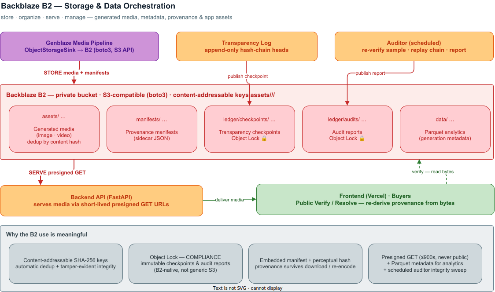

<div align="center">

# OriginShot — Prove What's Real, Generate the Rest

### *"Every AI product photo answers 'does this look good?' None of them answer 'is this the actual product?'"*

[](LICENSE)
[](https://backblaze-genblaze.devpost.com)
[](https://www.backblaze.com/cloud-storage)
[](https://github.com/backblaze-labs/genblaze)
[](https://gmicloud.ai)
[](https://fastapi.tiangolo.com)
[](https://nextjs.org)

**One phone photo in. A full marketplace-ready catalog out — where every generated file
carries an embedded, cryptographically verifiable record of exactly how it was made.**

[**Live App**](https://originshot.vercel.app) · [**API**](https://originshot-api.onrender.com/healthz) · [**API Docs**](https://originshot-api.onrender.com/docs) · [**Verify a File**](https://originshot.vercel.app/verify)

</div>

---

## The Problem

A seller lists a used camera lens. The photo is stunning — even lighting, perfect white
background, no dust. It was also generated by AI from one dim phone snapshot, and the AI
quietly removed a scratch that was really there.

Nobody in that transaction can tell. Not the buyer, not the marketplace, not the seller
six months later during a dispute. Meanwhile:

- Professional product photography costs **$25–150 per product**; a 150-SKU shop can't afford it
- Every channel wants different dimensions — Amazon pure-white 2000×2000, Etsy 2000×1600 lifestyle, Social 4:5
- The **EU AI Act** and a growing list of marketplaces now require disclosing AI-generated imagery
- Existing AI photo tools solve the *first* problem and actively worsen the last two

Tools that generate images answer *"does this look good?"* **OriginShot also answers
*"is this the actual product?"*** — and can prove the answer from the file's own bytes,
offline, with no call back to our servers.

---

## Live Deployment

| Surface | URL |
|---|---|
| **Web app** | https://originshot.vercel.app |
| **REST API** | https://originshot-api.onrender.com |
| **Swagger / OpenAPI** | https://originshot-api.onrender.com/docs |
| **Health check** | https://originshot-api.onrender.com/healthz |
| **Check a listing** (no login) | https://originshot.vercel.app/check |
| **Public verifier** (no login) | https://originshot.vercel.app/verify |
| **Resolve a dispute** (no login) | https://originshot.vercel.app/resolve |
| **Transparency log + last audit** (no login) | https://originshot.vercel.app/ledger |
| **Library** (signed in) | https://originshot.vercel.app/library |

> The API runs on Render's **free tier**, which sleeps after ~15 minutes idle. A
> [keep-warm workflow](.github/workflows/keep-warm.yml) pings `/healthz` every 10 minutes so
> this should never bite; if it does, the first request cold-starts in ~50s.

You can explore the full experience without an account through the public surfaces above —
`/check`, `/verify`, `/resolve` and `/ledger` need no login — or create an account to run your
own generation in the Studio.

---

## The Marquee Moment — Provenance That Survives the Round Trip

Download any generated file from OriginShot, drag it into
[`/verify`](https://originshot.vercel.app/verify), and the app re-derives the truth from
the bytes alone — it never trusts its own database:

```
FILE  studio-cec2a305.png                                  ✓ MANIFEST PRESENT
──────────────────────────────────────────────────────────────────────────────
Integrity      ✓ VERIFIED       manifest canonical hash recomputed and matched
Content bound  ✓ BOUND          media bytes match the hash the manifest signed
Classification   AI-GENERATED

  Provider     gmicloud-image
  Model        gemini-3-pro-image-preview
  Derived from 4b2b705dbcdd…  (authentic original, SHA-256 anchored on upload)

Disclosure  "AI-generated image. Model: gemini-3-pro-image-preview (gmicloud-image).
             Derived from authentic source 4b2b705dbcdd. Provenance verifiable
             via OriginShot."
```

Now edit one pixel of that file and drop it in again:

```
Integrity      ✓ VERIFIED       the manifest itself is untampered
Content bound  ✗ BROKEN         media content no longer matches its signed hash

⚠ Tampered: this file carries an OriginShot manifest, but the media content has been
  altered and no longer matches the signed hash.
```

**That second result is the product.** A manifest you can forge or detach proves nothing.
OriginShot binds the manifest *to the pixels*: `content_bound` recomputes the canonical
content hash by stripping the manifest back out of the container — PNG `iTXt`, MP4 `uuid`
box, JPEG APP1 XMP, WebP `XMP ` chunk — and comparing it to the hash the manifest committed
to. See [`originshot_pipelines/provenance.py`](backend/originshot_pipelines/provenance.py).

> **Why we wrote our own embedder for JPEG/WebP.** Both SDK handlers re-encoded through
> Pillow, which destroys the exact bytes the manifest committed to and makes
> strip-and-rehash verification impossible. OriginShot injects the manifest
> **byte-preservingly** (JPEG APP1 / WebP RIFF chunk) so those formats get real
> content-binding too. PNG and MP4 use the SDK path, which already appends cleanly.
>
> *Re-verified on genblaze-core 0.3.6 (2026-07-19): **JPEG is now byte-preserving upstream**
> — that half of our workaround has been fixed in the SDK. **WebP still re-encodes** and
> still loses content-binding, so our embedder remains load-bearing there. We kept one code
> path for both formats rather than making it release-conditional.*

> **Why our own manifest, and not C2PA?** C2PA is the industry provenance standard and the
> right *interop* target — the roadmap adds a C2PA-shaped export of our manifest so an OriginShot
> asset can carry a credential the wider ecosystem (Adobe, camera makers) already reads. We
> didn't build the core *on* C2PA because its trust model is a poor fit for a single application:
> a C2PA claim is only as meaningful as the signing certificate behind it, which presumes a
> recognized CA / trust list — infrastructure a hackathon entry can't stand up, and a self-signed
> C2PA manifest asserts little. OriginShot instead makes a claim that needs **no trust list to
> check**: the manifest is bound to the bytes by a hash the verifier *recomputes by stripping the
> manifest back out of the container*, so "these exact bytes match the record" is provable
> offline; the [transparency log](#the-transparency-log--what-a-per-file-manifest-cant-tell-you)
> answers a question C2PA's per-asset scope doesn't (*what else was generated?*); and Ed25519 over
> a repo-published key gives authorship without a CA. Complementary, not competing — which is why
> the plan is to export *to* C2PA, not replace our binding with it.

---

## The Transparency Log — What A Per-File Manifest Can't Tell You

A manifest proves how *that* file was made. It says nothing about **what else was made**. A
seller who regenerated a product photo twelve times until an inconvenient scratch disappeared
leaves no trace in any individual file: each one is honest, and the history is invisible.

So every manifest this instance issues is appended to a hash chain, and the head is published
to B2 as a **checkpoint**:

```
entry_hash[n] = SHA256({ seq, prev_hash, subject_sha256, manifest_hash, kind, recorded_at })
```

Each entry commits to its predecessor, so an entry cannot be altered, reordered or removed
without changing every hash after it. Once a checkpoint is published, the history it commits
to is fixed. Browse it at [`/ledger`](https://originshot.vercel.app/ledger) — then don't
believe that page, because it is rendered by the same server that wrote the log:

```bash
python scripts/verify_ledger.py --save checkpoint.json     # today
python scripts/verify_ledger.py --against checkpoint.json  # a week later
```

[`scripts/verify_ledger.py`](scripts/verify_ledger.py) talks only to the public
`/api/ledger` endpoints and recomputes every hash locally. Its chain logic is vendored into
the file rather than imported, so it can be handed to a sceptic on its own — reading forty
lines of hashing is a much lower bar than trusting an installed package. Run against a log
whose history had been rewritten, it reports exactly that:

```
  OK   chain replays over 8 entries
  OK   checkpoint hash matches its own contents (size=6, 57cbab90082c89f7…)
 FAIL  replaying the first 6 entries reproduces the published head
 FAIL  history before entry 6 is unchanged — EARLIER ENTRIES WERE REWRITTEN
```

That output is the whole idea in four lines. The rewritten chain **replays perfectly** — a
forger rebuilt every hash after the edit, so internal consistency proves nothing on its own.
What catches it is the previously published checkpoint, which the doctored history can no
longer reproduce.

### The Auditor — the log with a heartbeat

A log nobody checks is a log nobody checks. Every few hours a scheduled **Auditor**
([`app/auditor.py`](backend/app/auditor.py), driven by
[`.github/workflows/auditor.yml`](.github/workflows/auditor.yml)) does, unattended, exactly
what a sceptical customer would do by hand:

```
Last audit · 2h ago                                        ✓ 25 / 25 verified
──────────────────────────────────────────────────────────────────────────────
Assets re-verified   25 / 25 passed     re-downloaded from B2, re-hashed,
                                        embedded manifests re-extracted + verified
Chain replay         consistent         all 148 entries replayed
Published head       reproduced         replaying the first 140 reproduces the checkpoint
Report               ledger/audits/audit-20260719T0317Z-9f2c1e04b7aa.json
```

It re-downloads a random sample of stored media and re-derives each file's integrity from
its **bytes alone** (does the object still hash to the content address it is stored under;
does its embedded manifest still verify and still bind to the media), replays the chain
against the last *published* checkpoint, cuts a fresh checkpoint — the timer-based cut that
entry-count checkpointing can't provide during a quiet period — and publishes its report to
B2 under a key carrying the report's own SHA-256.

This catches what nothing else here catches: **silent** failure. Bit rot, a bad write, or
bytes swapped under a content address would otherwise sit unnoticed until a customer
happened to hit the one damaged file. Swap an object's bytes and the next pass names the
exact hash and the exact check that failed. It is also, deliberately, the instance marking
its own homework — the page says so, and independent verification remains the standalone
script below.

### B2 Object Lock — the published checkpoint you can't quietly rewrite

Publishing a checkpoint to object storage only helps if the checkpoint itself can't be
edited after the fact. The obvious objection writes itself: *the operator controls the
bucket, so they could overwrite an inconvenient checkpoint and no one would know.* That was a
real hole, stated plainly in the limitations below in earlier versions of this document.

**Backblaze B2 Object Lock closes it** — and it is the one place this app reaches past the
generic S3 API for a B2-native capability. When configured, every transparency checkpoint and
every audit report is written with a **compliance-mode retention** (`ObjectLockMode`,
`ObjectLockRetainUntilDate`): B2 will refuse to alter or delete that object until the
retention expires — **not for the operator, not for a root credential, not for anyone.** A
published checkpoint stops being "trust us not to rewrite history" and becomes "history that
cannot be rewritten." The `/ledger` page shows the lock and its expiry; the checkpoint JSON
carries `retained_until` — and *only* when a lock was genuinely applied.

That last clause is the discipline that keeps this honest. The write path degrades safely: if
the bucket has no file lock or the key lacks `writeFileRetentions`, the checkpoint still
publishes (a best-effort log must never be *lost*), but it publishes **unlocked**, the event
is logged loudly, and `retained_until` is omitted — so an object is never *described* as
immutable when it isn't. `/healthz?deep=true` reports the true state
(`object_lock: active | misconfigured | disabled`) rather than letting the app advertise a
guarantee it isn't delivering.

> **Enabling it** is a one-time B2 setup, deliberately off by default (`B2_OBJECT_LOCK_DAYS=0`)
> until that setup exists: (1) enable Object Lock on the bucket (or a dedicated `…-ledger`
> bucket — it's a one-way switch, so a fresh bucket is the clean choice), (2) mint an
> application key carrying `writeFileRetentions` + `readFileRetentions`, and (3) set
> `B2_OBJECT_LOCK_DAYS` to the retention period. The app then locks every new checkpoint and
> audit report with zero further changes. See [`app/storage.py`](backend/app/storage.py)
> (`put_immutable`) and [`.env.example`](.env.example).

### Witnessed by Bitcoin — the timestamp we can't control either

Object Lock and the Ed25519 signature both harden the log, and both share one weakness: they
rest on infrastructure **we** control. Object Lock is *our* bucket under a retention *we*
configured; the signature is *our* key. A sufficiently determined operator still owns both. So
"this head existed by time T and hasn't been rewritten since" ultimately still asked you to
trust us — the exact thing this project refuses to do anywhere else.

So every checkpoint hash is now anchored into the **Bitcoin blockchain** via
[OpenTimestamps](https://opentimestamps.org) ([`app/witness.py`](backend/app/witness.py)). At
publish time the hash is submitted to public calendar servers (a verifiable commitment
immediately); a few hours later the **Auditor** upgrades that commitment to a confirmed Bitcoin
attestation. The result is a timestamp anchored in a chain **the operator does not control and
cannot backdate or rewrite** — the first trust anchor in this project whose root is not our own
infrastructure.

```
WITNESS  checkpoint 57cbab90082c…                          ✓ ANCHORED IN BITCOIN
──────────────────────────────────────────────────────────────────────────────
OpenTimestamps  proof commits to the checkpoint hash        served at /checkpoint.ots
Bitcoin         block 800,123                                the operator does not control this
Verify yourself curl -sO …/api/ledger/checkpoint.ots && ots verify checkpoint.ots
```

The `.ots` proof is public at
[`/api/ledger/checkpoint.ots`](https://originshot-api.onrender.com/api/ledger/checkpoint.ots),
so anyone runs `ots verify` against Bitcoin needing nothing from us. And it makes the split-view
problem — the transparency log's headline limitation, once flatly "undetectable" — genuinely
detectable: since every head is *also* signed by our one key, two conflicting chains are each
self-incriminating, and Bitcoin supplies the independent timestamp that dates each. Best-effort
by contract, exactly like signing and Object Lock: if the calendars are unreachable a checkpoint
publishes with no anchor rather than a false one, and the Auditor tries again. The one honest
gap that remains — gossip between independent witnesses so no victim has to find the other — is
named below, not papered over.

### What this does not prove

Stated as plainly as the rest, because a transparency log that overstates itself is worse
than none:

- **Signed, but by one key.** Every checkpoint, audit report and dispute report is now
  **Ed25519-signed** ([`app/signing.py`](backend/app/signing.py)); the signature is over the
  artefact's own content hash and verifies offline against the **public key committed in this
  repo** (in [`scripts/verify_ledger.py`](scripts/verify_ledger.py) and `signing.py`), so a
  third party checks it against a key they got from GitHub, not from our server. That closes
  the old "anyone with bucket write access could forge a checkpoint" hole. One key cannot rule
  out a **split view** *alone* — but it is half the fix: two conflicting chains would both be
  signed by this key, so they are self-incriminating the moment they meet, and the Bitcoin
  witness below supplies the independent timestamp that makes that meeting conclusive.
- **Object Lock stops rewriting, not withholding.** A compliance-mode lock makes a *published*
  checkpoint physically immutable — the operator can no longer alter a bad result after
  publishing it. It does **not** force the operator to run the Auditor or to publish at all;
  that half of the problem is the witness gap below, which Object Lock does not close.
- **The Auditor is self-audit.** It protects against silent corruption and drift, not
  against a dishonest operator, who could simply not run it or not publish a bad result.
  The load-bearing check remains the standalone verifier, which needs none of our code.
- **Witnessed by Bitcoin, not just by us — split view now detectable, not yet gossiped away.**
  Every checkpoint hash is anchored into the **Bitcoin blockchain** via
  [OpenTimestamps](https://opentimestamps.org) ([`app/witness.py`](backend/app/witness.py)) —
  the one anchor whose trust root is *not* our own infrastructure (Object Lock is our bucket,
  the signing key is ours; Bitcoin is nobody's). The `.ots` proof is served at
  [`/api/ledger/checkpoint.ots`](https://originshot-api.onrender.com/api/ledger/checkpoint.ots)
  so anyone can `ots verify` it against Bitcoin needing nothing from us. This closes **backdating
  and silent rewriting of a published head**, and — because every head is also signed by one key
  — makes a **split view detectable the moment two parties compare** the checkpoints they were
  shown. What it does *not* yet do is force both heads in front of a common auditor; gossip
  between independent witnesses is the remaining step, named here rather than claimed as done.
- **Absence proves little.** Appends are best-effort so a ledger outage can never fail a
  generation the provider already billed for. Presence plus a consistent chain is the
  load-bearing claim; absence is not evidence, and `/verify` deliberately shows no negative
  signal for an unlogged file.
- **Inclusion proofs are O(n−k), not O(log n).** This is a chain, not a Merkle tree. Correct,
  and honest about its cost.

---

## Replay — Provenance You Can Execute

Everything above points provenance *backwards*: it proves how an existing file was made.
But a Genblaze manifest carries the complete step spec — provider, model, prompt, seed,
params — which means it can **drive** a new run, not merely describe an old one. One button
on any generated asset:

```
REPLAY  studio · from manifest run-9f2c1e04                    ✓ REPLAY COMPLETE
──────────────────────────────────────────────────────────────────────────────
Spec source     the stored manifest — NOT today's prompt templates
Model           gemini-3-pro-image-preview          (recorded, no fallback substitution)
Prompt          "Professional e-commerce product photograph of a handmade…"
Reference       re-presigned from the anchored original by content hash
New asset       7c41ab90e3d5…   replay_of ea88b1f0…   parent 05993b99…
Ledger          entry #149, kind=replay
```

Two decisions are the whole feature. **The spec comes from the manifest, verbatim** — if
the prompt templates in this repo have changed since the original run, a replay still runs
the *original* words; that is what reproducibility against a record means. And **fallbacks
are stripped**: a fresh generation may degrade to a fallback model because its promise is
"produce the style", but a replay's promise is "this exact spec", and an output quietly
served by a different model would contradict the very manifest being replayed.

The one thing that can't be replayed verbatim is the reference-image URL — the manifest
recorded a presign that expired minutes after the run. Replay re-presigns the same
*content* instead, resolved from the asset's `parent_sha256`, which is a stronger binding
than any URL. (Video is excluded for exactly this reason: its input was a generated
intermediate, not the anchored original.) Determinism is not claimed — the seed is carried
when present, but providers don't guarantee bit-identical output, so the replayed asset
gets its own hash, its own manifest and its own ledger entry rather than impersonating the
old one.

Replay is also what makes the transparency log's central claim demonstrable: run it a few
times and the log fills with `kind=replay` entries. Each individual file stays honest; the
*history* is what shows the seller regenerated the shot until the scratch went away.

## Catalog Mode — The Whole Shop In One Run

The problem statement above says *"a 150-SKU shop can't afford it"*. Generating one product
at a time is not a product for that shop. [**Catalog Mode**](https://originshot.vercel.app/studio/catalog)
takes a folder of photos, makes one product per photo, and runs the lot:

```
Generating catalog          2 of 5 products complete · 2 at a time
▓▓▓▓▓▓▓▓ ▓▓▓▓▓▓▓▓ ▒▒▒▒▒▒▒▒ ░░░░░░░░ ░░░░░░░░

✓ Handmade ceramic mug      done         3 assets   74.6s   $0.0400
✓ Green glass bottle        done         3 assets  126.5s   $0.0400
◐ Linen apron               developing
○ Walnut serving board      queued
⊘ Brass candlestick         not started  — insufficient credit (needs $0.08)
```

**Every SKU is still an ordinary job.** Catalog Mode does not fork a second generation path:
it submits the same job the single-product button submits, so credit holds, settlement,
per-style isolation, QA retries and provenance embedding behave identically whether a photo
ran alone or as item 47 of a catalog. What the batch adds is exactly three things — bounded
concurrency, per-item bookkeeping, and honest partial results.

A few decisions worth naming, because they are where a bulk feature usually goes wrong:

- **Per-job credit holds, not one batch hold.** A single hold across N SKUs would need
  reconciling against N settlements, and any crash between them strands credit no operator
  can reason about. Holding per job preserves the ledger's existing one-hold-one-settlement
  invariant exactly.
- **`not started` is not `failed`.** A catalog can exhaust its balance or daily quota
  halfway through. Those products never ran and cost nothing, so they report as blocked and
  are trivially re-runnable. Telling a seller their photos *failed* when they merely ran out
  of credit is a lie that generates a support ticket.
- **Concurrency is bounded and deliberately low.** Generation is I/O-bound on the provider so
  parallelism buys wall-clock cheaply, but each in-flight job also holds decoded image bytes
  for QA scoring in the same process, and the deployment target is a 512 MB free-tier
  instance. Verified live: two SKUs at concurrency 2 finished in 128s against 201s of summed
  work.
- **The bulk download is not a reduced pack.** Every product folder in the catalog ZIP is
  byte-identical in structure to a single-product export — same `verified/` masters, same
  certificate, same disclosure — because both go through one `write_pack`. A test asserts the
  two archives agree entry-for-entry, so a thinner bulk pack can't quietly ship.

Uploads deliberately go through the ordinary per-SKU route, one file at a time, rather than
one giant multipart request: it keeps a single hardened upload path (magic-byte validation,
pixel caps, bomb guards, EXIF stripping), keeps a twelve-photo catalog off a request a
free-tier instance would drop, and lets the UI show real per-file progress.

---

## Catalog Intelligence — Search The Shop, And Catch What Shouldn't Be There

A catalog is not just files to store — it's files to *search and police*. Once a seller has
dozens of products, two questions a per-SKU view can't answer start to matter, and both are
cross-catalog reads over what's already on B2. [**`/catalog`**](https://originshot.vercel.app/catalog)
answers them ([`app/catalog_intel.py`](backend/app/catalog_intel.py)).

**Search by meaning — a vector index backed by B2.** Each SKU's AI-generated text (title,
facts, and the per-marketplace listing copy) is embedded with OpenAI `text-embedding-3-small`
through the same key that serves the voiceover, and the vectors are written to B2
(`embeddings/<uid>.json`) as the durable, portable index — the same repo-plus-B2 pattern the
transparency checkpoints use. A query is embedded and ranked by cosine, so "which of my products
are ceramic?" is answerable by *meaning*, not a filename or a hash. Honest about scope: it's a
linear scan over stored vectors behind the catalog's own scale (a real HNSW index earns its
complexity at millions of rows, not one shop's), and it **degrades to "unavailable" with no key**
— a distinct state from "found nothing", so the UI never implies an empty shop. The visual and
integrity halves below need no model at all.

**Visual similarity — free, from the pHash you already store.** "Find the other products that
look like this one" is the *same* perceptual hash the [buyer-side verifier](#verify-anywhere--provenance-that-travels-to-the-buyer)
uses, scoped to the seller's own catalog — no model, no new storage.

**Integrity — the fraud thesis, turned on the whole shop.** Every other surface asks *"is this
the real product?"* Catalog Intelligence asks *"is this seller honest across their whole shop?"* —
and answers it from data already stored:

```
CATALOG INTEGRITY   dev-user · 14 products                    ⚠ 2 SIGNALS FOR REVIEW
──────────────────────────────────────────────────────────────────────────────
Reused original     one authentic photo 05993b99f9af… → 3 different listings
Near-duplicate      2 products share a near-identical source upload (pHash dist 3/64)
```

- **Reused original** groups generated assets by `parent_sha256` and flags any authentic
  original that anchors **more than one distinct SKU** — the exact-reuse signal. The trick is
  counting *distinct SKUs*: every style within one product legitimately shares a parent, so a
  normal multi-style SKU never fires.
- **Near-duplicate sources** clusters the per-SKU *original* pHashes (union-find, strict
  threshold), catching what exact-reuse can't — a seller who re-saved or re-shot one item and
  listed it as several, where the bytes differ but the picture doesn't.

Both are **signals for review, never accusations** — a seller may legitimately list variations —
so they flag for a human rather than concluding fraud. That restraint is the same honesty stance
the rest of the project takes, and it is exactly what makes the signal trustworthy. No competitor
in this space turns provenance into a *cross-catalog* authenticity check.

---

## Voiceover — The Narration With Provenance

The studio image and hero video are the shot. A product video also wants a *voice* — and that
voice is where OriginShot's thesis meets a modality nobody else in this space provenance-tracks.
Add `voiceover` to a run and one authentic photo now drives text, image, video **and** audio:

```
VOICEOVER  sku · handmade-ceramic-mug                          ✓ AUDIO · PROVENANCE EMBEDDED
──────────────────────────────────────────────────────────────────────────────
Script      GMI Cloud · zai-org/GLM-5.1-FP8   (AI-written from the SKU facts, disclosed)
            "This handmade ceramic mug brings quiet warmth to your kitchen. Crafted from
             stoneware, it features a two-tone glazed finish. With a 350ml capacity…"
Speech      OpenAI · gpt-4o-mini-tts · voice=onyx        audio/mpeg  232 KB  in 7.0s
Manifest    ✓ present  ✓ verified   embedded in the MP3 (ID3)     content_bound  — (audio)
Ledger      entry #163, kind=asset      openai-tts now in the provider-mix chart
```

Three decisions carry it, and each is one the judging criteria reward directly:

- **It's a genuine multi-provider, multi-modality chain.** GMI's `GLM` writes the script;
  **OpenAI TTS** renders the speech. That is "orchestrate across models, providers, or steps"
  shown in one run, not asserted — and it exists *because* GMI's own audio is unreachable
  ([issue 04](docs/genblaze-issues/04-gmi-audio-modality-unreachable.md)). Rather than fake it
  or cut it, we did the one thing this architecture is built for: **swapped providers** through
  Genblaze's unified API. Audio was never dead — it was one swap away.
- **The narration carries its own provenance.** It flows through the *same* generation path as
  every image and video (`app/generation.py`): the manifest embeds into the MP3, the bytes are
  stored content-addressably on B2, and the asset gets a transparency-log entry. This is
  provenance-tracked AI *audio* — a claim we can make because the narration is treated as
  generated media, not a decorative afterthought.
- **The script is AI-written, and says so.** The words come from the listing/chat model, so the
  asset records both the script text and that a model produced it — disclosed in the manifest,
  never passed off as human copy. If the chat endpoint 429s, a deterministic script from the
  SKU's own facts keeps the audio alive (the same "never hard-depend on chat" rule the QA and
  listing tiers follow).

**The payoff: a product video that talks — and it's the one audio-path asset with full
content-binding.** When the run also produced a hero video, the narration is muxed onto it into
a narrated MP4. That happens through the SDK's ffmpeg compositor in a real Genblaze pipeline, so
the muxed file carries a manifest and flows through the *same* `_map` path as every image and
video: content-addressable on B2, embedded manifest, ledger entry — and because it's an **MP4**,
the strip-and-rehash canonical hash *does* bind it, so unlike the standalone audio it verifies
all the way to `content_bound`. The mux loops the hero clip to the narration's length so nothing
is truncated, and ffmpeg ships bundled (`imageio-ffmpeg`), so it works on Render with no image
changes. No ffmpeg, or no hero video? The mux is skipped and the standalone narration still
ships — a graceful degradation, never a failed style.

Honest about the one seam: **`content_bound` is `None` for the standalone audio.** The
strip-and-rehash canonical hash covers PNG/MP4/JPEG/WebP, not raw audio, so the narration clip is
*present + verified* — one tier below the round-trip binding, and said out loud wherever an audio
result is shown (the muxed MP4 above closes that gap for the video). With no `OPENAI_API_KEY` the
style is skipped with a reason, never a silent empty clip. See
[`originshot_pipelines/voiceover.py`](backend/originshot_pipelines/voiceover.py).

---

## Verify Anywhere — Provenance That Travels To The Buyer

Every verification surface above assumes you already **hold the file**. A buyer looking at a
live Etsy or eBay listing holds neither the file nor an account — they have a link, or at most
the photo they can drag off the page. And the file that marketplace serves is the one place our
cryptographic tiers go silent: the platform re-compressed the image on upload, which changes the
bytes (so the SHA no longer matches) and strips the embedded manifest. **The provenance a seller
can prove is provenance on files downloaded from us — precisely where it is least needed.**

[**`/check`**](https://originshot.vercel.app/check) closes that gap. It's public, account-free,
and buyer-framed — *"Is this listing photo real?"* Paste a listing or image link, or drop the
photo, and it answers from the **perceptual "Verify in the Wild"** tier
([`originshot_pipelines/perceptual.py`](backend/originshot_pipelines/perceptual.py)): a DCT
perceptual hash survives a resize + JPEG round-trip that destroys every cryptographic signal, so
it recognises the re-encoded copy and traces it back to a known OriginShot asset.

```
CHECK  https://www.etsy.com/listing/…                         ⚠ VISUAL MATCH · EVIDENCE
──────────────────────────────────────────────────────────────────────────────
Source          read that page, checked 1 photo on it
Cryptographic   ✗ no surviving manifest, no exact-hash record   (marketplace re-encoded it)
Perceptual      ✓ closely matches known asset 4b2b705dbcdd…     distance 2/64
Classification    AI-GENERATED · gemini-3-pro-image-preview (gmicloud-image)
Lineage         traces to authentic original 05993b99f9af…      (hash only — never the image)
Verdict         "…resembles a known OriginShot asset. This is a visual-similarity match —
                 evidence, not a cryptographic guarantee."
```

Four decisions carry it, and each maps to a judging criterion:

- **Same engine, new surface — not a second code path.** `/check` calls the exact `verify_bytes`
  core behind `/verify` ([`app/api/verify.py`](backend/app/api/verify.py)), so the buyer and
  seller surfaces can never disagree about the same file. What's new is only the *reach*: a
  buyer's link, fetched server-side.
- **Evidence, never dressed as proof.** A perceptual match is a similarity claim; the raw
  bit-distance is always shown, the copy says so, and it **never** sets the cryptographic
  `content_bound` flag. A non-match is grey ("no record — absence isn't proof"), never a red
  "fake". Same honesty discipline as the rest of the project.
- **Buyer privacy posture, inherited from [Resolve](#resolve--provenance-that-shows-up-for-the-argument).**
  The response carries the lineage **hash** and the model, **never the seller's private
  original image**.
- **A public URL-fetcher, hardened like one.** This is the app's one endpoint that fetches a
  caller-supplied URL — a classic SSRF surface — so it goes through a single hardened choke point
  ([`app/fetch.py`](backend/app/fetch.py)): http/https + standard-ports only, **every** resolved
  IP checked against private / loopback / link-local (the `169.254.169.254` metadata address) /
  CGNAT ranges, redirects re-validated per hop, and size + timeout caps. Unlike `/resolve` it
  calls **no** provider, so there is no denial-of-wallet exposure — the controls are purely
  anti-SSRF, and the residual DNS-rebinding window is documented honestly rather than hidden. See
  [`docs/SECURITY.md` §10.1](docs/SECURITY.md).

**Why this matters for the thesis.** The embeddable badge puts provenance where the buyer is only
*if the seller embeds it and the marketplace preserves it* — and the marketplace re-encode that
strips the manifest is exactly what defeats it. `/check` needs neither: the buyer initiates it,
on any listing, and the perceptual tier is built to survive the re-encode. It turns provenance
from a feature the seller enjoys into a check the buyer can actually run.

---

## Resolve — Provenance That Shows Up For The Argument

The scenario this project opens with ends *"…not the seller six months later during a
dispute."* Every other surface in OriginShot serves the seller **before** the sale. Resolve
serves the moment the provenance is actually worth something, for the people on the other
side of the transaction.

[**`/resolve`**](https://originshot.vercel.app/resolve) is public and account-free — a buyer
disputing a parcel has no login here, and a tool that demands one is a tool that never gets
used in the argument it exists for. Drop in the listing photo and, optionally, a photo of
what actually turned up:

```
FINDING   condition_differences                                        ⚠ WARNING
──────────────────────────────────────────────────────────────────────────────
The right product, but the delivered item differs in condition

Listing image   authentic original, anchored by SHA-256 on upload
                integrity confirmed · content binding intact
Anchored orig.  05993b99f9affece…   ← the pre-AI photo, not the marketing shot
Delivered photo fbef4702dcbee811…   ← hash only; the image itself is never stored

Comparison      9 / 10 same physical product        (x-ai/grok-4.5)
  "The two images show the same physical handmade ceramic mug, with identical
   shape, proportions, two-tone glaze, speckled texture and handle form."

  Visible differences in condition or completeness
  — small brownish mark/chip on inner rim
  — diagonal scratch on lower body
```

Two questions answered together, because a dispute is always both: *was the listing photo
honest about how it was made* (re-derived from the file's bytes, no model involved), and *is
the delivered item the listed item* (compared against the **authentic anchored original**,
not the AI-generated shot it descends from). The output is a hash-anchored PDF stored
content-addressably on B2, resolvable by anyone holding the id printed on it.

**Why the verdict has six outcomes and not two.** The most common real dispute is not "wrong
item" — it is *right item, arrived damaged*. A high same-product score with defects logged
returns `condition_differences`, never a green pass: reporting that as "consistent" would
hand the complainant a document describing the very damage they reported. The scoring prompt
asks for identity and condition **separately** for exactly this reason. Live-benchmarked
before it shipped — same mug in a different shot 9/10, the same mug held in someone's hands
9/10, a green bottle 0/10, and a mug with a scratch and a chip painted on scored 9/10 while
naming both defects. That last row is the one the feature exists for.

> **Signed, and content-addressed.** This instance records the SHA-256 of the PDF it issued
> *and* **Ed25519-signs that hash** — so a copy can be proven both unaltered against the
> record and issued by the holder of the repo's published key, verifiable offline. The PDF
> names the signing key on its own face; the detached signature is published with the report.

---

## How It Works

<p align="center">
  
</p>

<p align="center"><sub>System architecture — source: <a href="docs/ARCHITECTURE.drawio"><code>docs/ARCHITECTURE.drawio</code></a></sub></p>

```
  ONE PHONE PHOTO
         │
         ▼
  ┌──────────────────┐   SHA-256 anchored as the AUTHENTIC source. EXIF/GPS stripped,
  │  Upload + anchor │   magic-byte validated, decompression-bomb guarded, re-encoded.
  └──────────────────┘   Stored content-addressably on B2.
         │
         ▼
  ┌─────────────────────────── GENBLAZE PIPELINES ───────────────────────────┐
  │                                                                          │
  │   studio ──┐                                                             │
  │  lifestyle ├─▶ Pipeline().step(GMICloudImageProvider, image=<source>)     │
  │   on-model │        gemini-3-pro-image-preview                           │
  │   variants ┘                                                             │
  │       │                                                                  │
  │       └── hero studio image ──▶ Pipeline().step(GMICloudVideoProvider)    │
  │                                   Kling-Image2Video-V2.1-Master          │
  │                                   ↳ fallback: pixverse-v5.6-i2v, wan2.6  │
  └──────────────────────────────────────────────────────────────────────────┘
         │
         ▼
  ┌──────────────────┐   ObjectStorageSink(KeyStrategy.CONTENT_ADDRESSABLE)
  │  B2 + provenance │   → identical bytes stored exactly once (dedup)
  └──────────────────┘   → manifest embedded in the media, sidecar JSON on B2
         │               → ParquetSink metadata export
         ▼
  EXPORT PACK (.zip)   verified/ (manifests intact) · amazon/ etsy/ shopify/ ebay/
                       social/ (exact dimensions) · manifests/ · disclosure.txt
```

Each style is **isolated**: one provider failure yields a *partial* pack, never a total
failure. Jobs report `done` / `partial` / `failed`, and the UI shows which styles fell back.

---

## Real-World Value

Product photography is the highest-frequency, most-hated chore in e-commerce, and the
market already pays for it. OriginShot removes the shoot and adds something no competitor
offers: **provable authenticity**. That matters for used and high-value goods, for
marketplace policy compliance, and for the EU AI Act's transparency rules — the export ships
a ready-to-file `disclosure.txt` and per-asset statements automatically.

The economics are not close. Professional product photography runs **$25–150 per product**;
a default OriginShot pack costs **$0.12 at list price**, and a studio pack completes in
**74.6s** (126.5s when the QA loop retried a style). Those are measured numbers with their
sample sizes, caveats and one honest gap recorded in
[`docs/BENCHMARKS.md`](docs/BENCHMARKS.md) — including why the provider-billed figure is
unavailable rather than quietly substituted with the estimate.

It also serves **two audiences, not one**. The Studio is for the seller;
[Verify Anywhere](#verify-anywhere--provenance-that-travels-to-the-buyer) and
[Resolve](#resolve--provenance-that-shows-up-for-the-argument) are for the buyer and the
marketplace, and need no account because they don't have one. That is what turns provenance from
a feature the seller enjoys into an asset the seller can spend — a listing whose photos the
buyer can check *on the listing itself*, recognised even after the marketplace re-encoded them,
and a claim that can be adjudicated from evidence instead of two conflicting stories. Marketplace trust
and safety teams settle these by hand today, at a cost per case that dwarfs the price of the
photography.

**And the provenance travels.** Every verified asset has an **embeddable badge** — a live SVG
(`/api/badge/{sha}.svg`) a seller drops into a marketplace listing with one ``. It resolves
against the transparency ledger on every request and links back to the public verifier, so the
claim shows up **where the buyer is**, not only inside our app. It's an image, not an iframe, so
it renders in the many listing surfaces that block frames; and it is scrupulously neutral about a
hash it doesn't know — a marketplace re-encode strips the manifest and changes the hash, so "no
record" shows grey, never a red "fake" (absence is not proof). Copy the snippet straight from any
`/verify/{sha}` page.

## Production Readiness

- **Auth on every route.** Firebase ID tokens verified server-side; `uid` comes only from the verified token, never client input. No dev bypass in production.
- **Per-user isolation** enforced in the backend *and* in Firestore rules (deny-by-default).
- **Upload hardening** — magic-byte type checks, size and pixel caps, decompression-bomb guards, EXIF/GPS stripping via full re-encode.
- **Security headers** on every response — CSP, HSTS, `X-Frame-Options`, `X-Content-Type-Options`, `Referrer-Policy`, `Permissions-Policy`.
- **Private bucket.** Media is served only through short-lived presigned URLs (15 min default) — no public objects.
- **Graceful degradation** — partial job results, provider fallback chains, and a storage/repo abstraction that runs fully offline in dev.
- **A health check that doesn't lie.** `/healthz` *exercises* each dependency rather than checking that an env var is set — it initializes the Firebase Admin SDK and (with `?deep=true`) round-trips to the B2 bucket, reporting `status: degraded` plus the failing exception type. It deliberately still returns **200** while the process is alive, because a failing health check makes the platform restart-loop the service; degradation belongs in the body. Config problems surface as **503**, never as an unhandled 500 — a 500 escapes the CORS middleware and reaches browsers disguised as a CORS error.
- **Denial-of-wallet, actually enforced.** Per-user daily quotas, plus a global per-IP ceiling and a tight dedicated limit on the one public endpoint that spends provider money (`/api/resolve`). The limiter keys on the left-most `X-Forwarded-For` entry — behind Render's proxy `request.client.host` is the same address for every visitor, so limiting on it would put the whole internet in one bucket and let the first burst lock everyone out.
- **380 automated tests** covering auth, IDOR isolation, upload validation, rate limiting, pipelines, provenance round-trips (including tamper detection across PNG/JPEG/WebP/MP4), transparency-log tampering and concurrent appends, the Auditor catching a swapped object, B2 Object Lock retention with honest unlocked fallback, the **Bitcoin witness** (OpenTimestamps stamping, describe/upgrade, best-effort degradation when calendars are down, and the served `.ots` proof), replay refusal paths and manifest-driven specs, cross-provider image fallback and per-provider cost settlement, the voiceover script/TTS chain (deterministic-script fallback, `instructions` gating, the Windows `file://` fix, audio cost settlement), perceptual "Verify in the Wild" matching of re-encoded files, the buyer-side `/api/check` surface and its **SSRF-hardened URL fetch** (private-IP / non-HTTP-scheme / odd-port / redirect-to-private / oversized-body rejections, plus listing-page image extraction), **Catalog Intelligence** (reused-original + near-duplicate-source detection, owner-scoped visual search, and semantic search with a fake embedder + graceful no-key degradation + the B2 vector-index write), cross-catalog library scoping, dispute-report findings, catalog credit and concurrency, incremental asset delivery, and the export ZIP.

## B2 Storage & Data Orchestration

<p align="center">
  
</p>

<p align="center"><sub>B2 storage &amp; data orchestration — source: <a href="docs/B2_DATA_ORCHESTRATION.drawio"><code>docs/B2_DATA_ORCHESTRATION.drawio</code></a></sub></p>

B2 is the system of record for every byte, not an afterthought:

| What lives on B2 | How |
|---|---|
| **Authentic originals** | `assets/<sha[:2]>/<sha[2:4]>/<sha>.png` — content-addressable, hash-anchored on upload |
| **Generated media** | Written by Genblaze's `ObjectStorageSink` with `KeyStrategy.CONTENT_ADDRESSABLE` |
| **Embedded deliverables** | After the manifest is embedded, the re-hashed bytes are stored under their *new* content address |
| **Sidecar manifests** | `manifests/<run_id>/<style>.json` — canonical provenance JSON |
| **Analytics** | Genblaze `ParquetSink` metadata export |
| **Transparency checkpoints** | `ledger/checkpoints/<size>-<hash>.json` — the published head of the append-only log |
| **Bitcoin witness proofs** | `ledger/checkpoints/<size>-<hash>.ots` — the OpenTimestamps proof anchoring that checkpoint's hash into Bitcoin |
| **Catalog search index** | `embeddings/<uid>.json` — the per-seller text-embedding vectors backing semantic catalog search |
| **Audit reports** | `ledger/audits/<audit-id>-<hash>.json` — each scheduled integrity pass, keyed by the report's own SHA-256 |

**B2 is the trust anchor, not just the blob store.** A transparency checkpoint kept only in
our own database would be worth nothing — the party you are being asked to trust is the same
party who could rewrite it. Publishing each head to object storage under a content-addressed
key gives it an existence independent of the application's own data, and the bucket's own
listing becomes a second record of when each head appeared. And with **Object Lock** on the
ledger prefix, that published head cannot be rewritten *even by us* until its retention
expires (see below).

### Backblaze B2 capabilities used — not just generic S3

| B2 capability | Where OriginShot uses it | Why it matters here |
|---|---|---|
| **Object Lock** (compliance-mode retention) | `put_immutable` on every transparency checkpoint + audit report ([`app/storage.py`](backend/app/storage.py)) | Turns "trust us not to rewrite history" into history that *cannot* be rewritten — unalterable even with root credentials. The tamper-proofing for the trust anchor. |
| **Content-addressable keys** | Every asset, manifest, checkpoint and report is keyed by the SHA-256 of its own bytes | Physical dedup (identical bytes stored once) *and* a key that doubles as an integrity check — the key **is** the hash `/verify` recomputes. |
| **Versioning** | Enabled on the bucket (the prerequisite Object Lock rides on) | A prior write is never silently lost under a re-PUT. |
| **Private bucket + short-TTL presigned GET** | All media served only via 15-min presigned URLs ([`app/storage.py`](backend/app/storage.py)) | No public objects; a leaked URL expires. |
| **Least-privilege, bucket-scoped keys** | `S3StorageBackend.for_backblaze(...)`, key scoped to one bucket | Blast radius of a compromised key is one bucket, and the ledger key adds only `writeFileRetentions`. |
| **Server-side `list_objects_v2` accounting** | The admin storage panel's true object/byte totals ([`B2Storage.stats`](backend/app/storage.py)) | Honest bucket size — B2 exposes no cheap size metric, so it is counted, bounded, and labelled `truncated`. |
| **Genblaze `ObjectStorageSink` + `ParquetSink` → B2** | The generation write path and analytics export | One storage backend for media, provenance and analytics. |

**Organized and searchable, not just durable.** The
[**Library**](https://originshot.vercel.app/library) is the cross-catalog view over
everything stored: filter by style, modality, authentic-vs-AI, or QA verdict, and search by
**content-hash prefix** — the same handle the ledger, `/verify` and the export certificates
all use, so "which of my files is `4b2b705d…`?" is answerable from the question the ledger
itself hands you. Filters run server-side, so a signed URL is minted only for the assets
actually being shown. And [**Catalog Intelligence**](#catalog-intelligence--search-the-shop-and-catch-what-shouldnt-be-there)
adds three more ways in over the same B2 objects: **semantic** search (a text-embedding vector
index stored on B2 at `embeddings/<uid>.json`), **visual** near-neighbour search (the stored
pHash), and cross-catalog **integrity** signals — organize, search, *and manage*, which is the
whole of what the criterion asks.

**Content-addressing is the cost story.** The key *is* the SHA-256 of the content, so
identical bytes — a re-uploaded original, a repeated generation, a shared scene plate — are
physically stored once. Dedup savings surface in the in-app analytics dashboard. Access is
via `S3StorageBackend.for_backblaze(...)` with a least-privilege key scoped to one bucket.

**The marketing site runs on real output, and its hashes resolve.** The landing page's
contact sheet is genuine pipeline output pulled from the B2 bucket by
[`scripts/sync-demo-assets.py`](scripts/sync-demo-assets.py) — no stock photography, no
placeholder glyphs. Because bucket keys *are* content hashes, the SHA-256 printed under
each frame is the real one: click any frame and `/verify` resolves it against the ledger.
The provenance claim on the homepage is checkable before you sign up.

## Built on Genblaze

Genblaze is the orchestration layer, not a single wrapped API call:

- **Multi-step pipelines** — `Pipeline("originshot-studio").step(provider, …)` per style, in [`originshot_pipelines/`](backend/originshot_pipelines/)
- **Agentic evaluate → retry → store** — every generated image is QA-scored (deterministic Pillow checks + a vision-model "same product?" score against the authentic original), the style regenerates once on failure, and the verdict ships in the asset's metadata and the UI ("passed QA on attempt 2"). See [`originshot_pipelines/qa.py`](backend/originshot_pipelines/qa.py)
- **Chaining with lineage** — the studio hero image feeds image-to-video; every generated asset records `parent_sha256` back to the authentic original
- **Fallback chains** — `fallback_models=[…]` on the video step (`pixverse-v5.6-i2v`, `wan2.6-r2v`) so a provider outage degrades instead of failing
- **Cross-provider, cross-modality orchestration** — one authentic photo fans out to a studio image and a hero video on **GMI**, while the **[voiceover](#voiceover--the-narration-with-provenance)** routes the narration to **OpenAI TTS**: GMI `GLM` writes the script → OpenAI renders the speech, a real multi-provider, multi-modality chain in one run. The audio modality exists by a *provider swap*, not a workaround — GMI's own TTS is unreachable ([issue 04](docs/genblaze-issues/04-gmi-audio-modality-unreachable.md)), and Genblaze's unified provider API is exactly what let us route around it, the same portability that carries image generation from GMI to OpenAI on a 402 (`originshot_pipelines/voiceover.py`)
- **Batch fan-out at two levels** — variant sweeps across colors and angles within one pack, and [Catalog Mode](#catalog-mode--the-whole-shop-in-one-run) running many SKUs' pipelines concurrently under a bounded semaphore
- **Incremental delivery** — each style's assets are persisted the moment that step completes, not when the job ends, so a pack with a five-minute video step fills the grid image by image instead of after a spinner. A crash mid-run keeps what was produced and settles credit against it, rather than discarding billed work
- **The same model reused across two jobs** — the QA evaluator is also Resolve's comparison scorer, re-benchmarked for the harder dispute question rather than assumed transferable
- **Provenance** — `EmbedPolicy` with `full` / `pointer` / `none` modes; `PipelineResult.save(embed=True)`; `manifest.verify()`; extraction via `get_handler(mime).extract()`
- **Executable provenance** — [Replay](#replay--provenance-you-can-execute) reads a stored manifest back into a live `Pipeline` step (`originshot_pipelines/replay.py`), so the manifest is a spec rather than only a record
- **Storage sink** — `ObjectStorageSink` + `S3StorageBackend.for_backblaze` + `ParquetSink`

Model IDs and kwargs are **runtime-verified against the installed SDK** by
[`tests/test_sdk_integration.py`](backend/tests/test_sdk_integration.py), so a catalog drift
fails CI rather than production.

### Two autonomous agents — that act, not just report

The hackathon brief names *"agentic media pipelines that generate, evaluate, retry, and store"*
as an example. OriginShot has two agents that do exactly that, and the distinction that matters
is that each one **acts on its own verdict** instead of handing a human a report:

- **The QA agent** ([`originshot_pipelines/qa.py`](backend/originshot_pipelines/qa.py)) closes a
  generate → evaluate → **refine** → store loop per style. It scores each image against the
  authentic original, and on a failure it doesn't merely flag — it lifts the failed checks into a
  Genblaze `EvaluationResult`, reads its `.feedback` exactly as `genblaze_core.agents.AgentLoop`
  does, and regenerates the style with that correction spliced into the prompt. The retry is a
  *fix*, not another roll of the dice, and the verdict ("passed QA on attempt 2, refined: …")
  ships in the asset and the UI.
- **The Auditor** ([`app/auditor.py`](backend/app/auditor.py)) is a scheduled, unattended
  integrity agent: every few hours it re-samples stored media, re-verifies each manifest from its
  bytes, replays the chain against the last published checkpoint, cuts and signs a fresh one, and
  publishes its own report to B2 — the loop a sceptical customer would run by hand, running itself.

This is deliberately **not** a wrap-an-LLM-in-a-trench-coat "agent" story. Both agents are narrow,
and the provenance thesis — not the agent framing — is the product; they are named here because
each genuinely closes an autonomous act-on-your-own-judgement loop, which is the thing the brief's
example rewards.

### Feedback to the SDK team

We upgraded to the current release (GitHub `v0.5.0`, published on PyPI as `genblaze` 0.4.3)
and re-tested our findings against it before reporting anything. Write-ups live in
[`docs/genblaze-issues/`](docs/genblaze-issues/):

| Finding | Status on 0.3.6 / 0.3.3 |
|---|---|
| **The entire GMI audio modality is unreachable** — the TTS/music `param_allowlist`s omit `text`/`lyrics`, the parameters the API requires, and never alias `prompt` onto them. Every audio model 400s. | **Reproduces** — reported, PR offered |
| `validate_model()` returns `ok_authoritative` for a model that 404s, and `unknown_permissive` for the one that works | **Still reproduces** — reported |
| WebP manifest embedding re-encodes the image, silently destroying content-binding | **Still reproduces** (JPEG fixed upstream) — reported, PR offered |
| Failed steps returned empty `assets` instead of raising | ✅ **Fixed upstream** — withdrawn, not reported |
| GitHub release `v0.5.0` publishes as PyPI `0.4.3`, so `genblaze==0.5.0` can't be installed | Reported (packaging) |

That first row is the most useful thing we found — and it *shaped* a feature rather than
killing one. We designed a voiceover step: SKU facts → narration script → text-to-speech → the
product video's spoken track. On GMI it cannot be built by anyone on 0.3.3 — the SDK strips the
required parameter before the request leaves the process, then reports the API's complaint
about its absence. So we did the one thing this whole architecture is built to do: **we swapped
providers.** The narration now renders on **OpenAI TTS** through Genblaze's unified provider API
— the same portability that carries image generation from GMI to OpenAI when GMI's request
queue is out of credit — and the audio carries its own embedded provenance manifest like every
other asset. The GMI defect is still real and still filed; it simply no longer costs us the
modality. That is the difference the SDK's provider abstraction actually makes, shown rather
than asserted. Full root-cause analysis, repro and suggested fix (plus the OpenAI-TTS
resolution) in
[`docs/genblaze-issues/04-gmi-audio-modality-unreachable.md`](docs/genblaze-issues/04-gmi-audio-modality-unreachable.md).

The third row is the point of the exercise: it *was* on our list, the upgrade fixed it, so
we dropped it. We also corrected two claims in this README that the new release made
outdated, rather than leaving a flattering-but-stale story about JPEG.

---

## Providers & Models

The canonical, single-source-of-truth list is
[`originshot_pipelines/registry.py`](backend/originshot_pipelines/registry.py). **This lists
only what the app actually calls today** — runtime-verified against our GMI Cloud account.

| Step | Provider | Model | Notes |
|---|---|---|---|
| Studio · Lifestyle · On-model · Variants | GMI Cloud (`gmicloud-image`) | `gemini-3-pro-image-preview` | Reference-image edit — the "one photo → many shots" engine |
| Hero video (image → video) | GMI Cloud (`gmicloud`) | `Kling-Image2Video-V2.1-Master` | Primary |
| Video fallbacks | GMI Cloud | `pixverse-v5.6-i2v`, `wan2.6-r2v` | Automatic on primary failure |
| Text → video (optional) | GMI Cloud | `Kling-Text2Video-V2.1-Master` | Single-step path, no source photo |
| **QA evaluator (vision)** | GMI Cloud (chat API) | `x-ai/grok-4.5` | Scores "is this the same physical product?" against the authentic original — the vision tier of the evaluate→retry loop |
| **Listing copy** | GMI Cloud (chat API) | `zai-org/GLM-5.1-FP8` | Per-marketplace titles/bullets/tags; hard limits enforced in code |
| **Voiceover script** | GMI Cloud (chat API) | `zai-org/GLM-5.1-FP8` | Writes the product-video narration from the SKU facts (reuses the listing model); a deterministic script is used if chat 429s |
| **Voiceover audio** (text → speech) | **OpenAI (`openai-tts`)** | `gpt-4o-mini-tts` | Renders the narration to speech — the app's **audio modality**, reached by a *provider swap* because GMI audio is unreachable ([issue 04](docs/genblaze-issues/04-gmi-audio-modality-unreachable.md)). Also verified: `tts-1` |

The chat models were chosen by **live probes on real product images**, not catalog presence
— several catalog models 404, 429, return empty completions, or silently accept images they
cannot see. The QA evaluator was benchmarked on four pairs before being wired in:

| Pair (reference → candidate) | Score |
|---|---|
| Same mug, different shot | 9 / 10 |
| Same mug, **hue-rotated** | 3 / 10 |
| A different object entirely | 0 / 10 |
| Identical image | 10 / 10 |

That third-place row is the one that matters: a recoloured product is the exact failure a
pixel-level check cannot see and a buyer would never catch. Two faster models were rejected
— one returned empty content on real photos despite passing a toy probe, the other scored
two shots of the *same* mug as 0. The evidence is recorded in
[`registry.py`](backend/originshot_pipelines/registry.py).

Nothing hard-depends on the chat endpoint: QA degrades to its deterministic tier and marks
the report `scorer: "deterministic"`, and listing copy returns an honest "try again" rather
than fabricating.

**An honest note on image fallbacks.** `IMAGE_EDIT_FALLBACKS` is currently **empty**. The
SDK's static catalog advertises `seededit-3-0-i2i-250628` and the `reve-*` models, and they
run in the GMI *console playground*, but they **404 against the request-queue API** our
account must use — and the SDK's `validate_model` probe reports them as fine. We removed
them rather than ship a fallback chain that silently doesn't exist. Genblaze's unified
provider API makes OpenAI `gpt-image-1`, Google Imagen/Veo, or Luma a per-step swap
(`SWAPPABLE_PROVIDERS` in the registry); none are wired today, so none are claimed.

---

## Export Packs

`POST /api/skus/{id}/export` returns a real ZIP, not a JSON manifest:

```
OriginShot-handmade-ceramic-mug/
├── README.txt          what's inside and how to verify it
├── certificate.pdf     Certificate of Provenance — every hash, model, QA verdict + QR
├── verify-qr.png       the QR badge alone, for dropping into a listing
├── disclosure.txt      per-asset AI-disclosure statements (EU AI Act ready)
├── pack.json           machine-readable index with lineage + compliance scorecard
├── verified/           byte-exact masters — embedded manifests INTACT
├── manifests/          sidecar provenance JSON per asset
├── listing/            paste-ready listing copy per channel (when generated)
├── amazon/             2000×2000, pure white, product fills ~85% of frame
├── etsy/               2000×1600, lifestyle context preserved
├── shopify/            2048×2048 square
├── ebay/               1600×1600, clean background
└── social/             1080×1350 portrait 4:5
```

Every pack ships with a **compliance scorecard** (in `pack.json` and live in the studio):
each rendition is measured — exact dimensions, border whiteness, product fill ratio —
against the channel's real rejection rules, on the same bytes the folders contain.

Marketplace renditions are re-encoded to hit exact listing dimensions, which necessarily
drops the embedded manifest — so `verified/` ships the untouched bytes alongside. **The
seller gets listing-ready files *and* files that still pass `/verify`.** White-background
channels use contain-fit on white honoring `min_fill_ratio`; lifestyle channels cover-crop.

---

## Quick Start

**Prerequisites:** Python 3.11–3.13 (not 3.14+), Node 20+, Poetry.

```bash
git clone https://github.com/rogerjeasy/originshot.git
cd originshot
cp .env.example .env        # one env file, read by BOTH apps
```

**Backend** — runs fully offline; without B2 + a GMI key it uses an in-memory repo,
local disk storage, and a generation mock, so the whole UX works with no cloud accounts:

```bash
cd backend
poetry env use 3.12
poetry install
poetry run uvicorn app.main:app --reload      # http://localhost:8000/docs
```

**Frontend:**

```bash
cd frontend
npm install
npm run dev                                    # http://localhost:3000
```

**Tests:**

```bash
cd backend && poetry run python -m pytest -q   # 339 passing
```

> **Auth is always enforced** — there is no production bypass. Signing in locally requires
> real Firebase web credentials in `.env`; the sign-in page tells you which keys are missing.

### Required environment

| Variable | Purpose |
|---|---|
| `B2_KEY_ID` · `B2_APP_KEY` · `B2_BUCKET` · `B2_REGION` | Backblaze B2, least-privilege key scoped to one bucket |
| `GMI_API_KEY` | GMI Cloud image + video models |
| `FIREBASE_PROJECT_ID` · `GOOGLE_APPLICATION_CREDENTIALS` | Firebase Admin (auth + Firestore) |
| `NEXT_PUBLIC_FIREBASE_*` | Firebase web SDK config |
| `NEXT_PUBLIC_API_BASE_URL` | Frontend → API base (inlined at **build** time) |
| `ALLOWED_ORIGINS` | Comma-separated CORS allowlist, exact match |
| `MANIFEST_EMBED_MODE` | `full` (default) · `pointer` · `none` |
| `DAILY_GENERATION_QUOTA` · `RATE_LIMIT_PER_MINUTE` · `RESOLVE_RATE_LIMIT` | Denial-of-wallet controls |
| `AUDIT_TRIGGER_TOKEN` · `AUDIT_SAMPLE_SIZE` | The Auditor's scheduler token (unset ⇒ the trigger refuses) and per-pass sample size |

Full list with defaults in [`.env.example`](.env.example).

---

## API Reference

| Method | Endpoint | Purpose |
|---|---|---|
| `GET` | `/healthz` | Liveness + per-dependency status (`?deep=true` round-trips to B2) |
| `POST` | `/api/users` · `GET /api/me` | Profile bootstrap |
| `POST` | `/api/skus` · `GET /api/skus` · `GET /api/skus/{id}` | Product CRUD |
| `POST` | `/api/skus/{id}/upload` | Upload + SHA-256 anchor the authentic original |
| `GET` | `/api/skus/{id}/assets` | Assets with short-lived presigned URLs |
| `GET` | `/api/assets` | **Library** — every asset across the catalog; filter by style, modality, authentic/AI, QA verdict, or content-hash prefix |
| `POST` | `/api/skus/{id}/generate` | Kick off a generation job (`202`) |
| `POST` | `/api/skus/{id}/assets/{assetId}/replay` | **Replay** — re-run an asset from its stored manifest (`202`) |
| `GET` | `/api/jobs/{id}` | Poll job status (`queued`/`running`/`partial`/`done`/`failed`) |
| `POST` | `/api/batches/estimate` | **Catalog Mode** — quote a whole catalog before running it |
| `POST` | `/api/batches` · `GET /api/batches` · `GET /api/batches/{id}` | Run and poll a catalog |
| `POST` | `/api/batches/{id}/export` | **Catalog ZIP** — one full pack per product |
| `POST` | `/api/skus/{id}/export` | **Marketplace ZIP pack** (renditions, masters, certificate, listing copy) |
| `GET`/`POST` | `/api/skus/{id}/listing` | Per-marketplace listing copy (chat model, limits enforced in code) |
| `GET` | `/api/skus/{id}/compliance` | Marketplace-readiness scorecard for the main image |
| `GET`/`PUT` | `/api/brand-kit` | Brand kit reused across generations |
| `GET` | `/api/analytics` | Assets, dedup savings, cost, provider mix |
| `POST` | `/api/verify` | **Public** — verify an uploaded file from its bytes |
| `GET` | `/api/verify/{sha256}` | **Public** — look up provenance by hash |
| `GET` | `/api/badge/{sha256}.svg` | **Public** — a live, embeddable provenance badge (SVG) for a listing |
| `GET` | `/api/ledger` · `/api/ledger/entries` · `/api/ledger/checkpoint` | **Public** — the transparency log, its raw entries and the published head |
| `GET`/`POST` | `/api/ledger/audit` | **Public** read of the latest integrity audit; POST runs one (scheduler token) |
| `GET` | `/api/ledger/proof/{sha256}` | **Public** — offline-verifiable inclusion proof |
| `POST` | `/api/resolve` | **Public** — issue a Dispute Evidence Report (rate-limited) |
| `GET` | `/api/resolve/{id}` | **Public** — resolve a report by the id on its PDF |
| `GET` | `/api/assets/{sha256}/manifest` | **Public** — non-sensitive manifest view |

---

## Project Structure

```
originshot/
├── backend/
│   ├── app/
│   │   ├── api/            skus · uploads · generate · batches · export · verify · resolve · analytics · brand_kit · users
│   │   ├── auth.py         Firebase ID-token verification (uid only from verified token)
│   │   ├── batches.py      Catalog Mode runner — bounded concurrency, per-item credit
│   │   ├── auditor.py      ⭐ scheduled integrity agent — resample, re-verify, replay, publish
│   │   ├── transparency.py log appends + checkpoint publication to B2
│   │   ├── config.py       pydantic settings + env mirroring for SDKs reading os.environ
│   │   ├── generation.py   pipeline orchestration, manifest embedding, per-style isolation
│   │   ├── security.py     headers · XFF-aware rate limits · upload validation · quotas
│   │   ├── storage.py      B2Storage / LocalStorage, content-addressable keys
│   │   ├── repo.py         Firestore repo + in-memory dev fallback
│   │   └── worker.py       job execution + per-step asset persistence (inline or Arq/Redis)
│   ├── originshot_pipelines/
│   │   ├── registry.py     ⭐ canonical providers/models (runtime-verified)
│   │   ├── provenance.py   ⭐ embed / extract / verify / content-binding
│   │   ├── transparency.py ⭐ append-only hash chain · checkpoints · proofs
│   │   ├── resolve.py      ⭐ dispute findings · item comparison · evidence PDF
│   │   ├── replay.py       ⭐ manifest → executable pipeline spec
│   │   ├── storage.py      Genblaze ObjectStorageSink → B2 + ParquetSink
│   │   ├── presets.py      marketplace dimensions + rendition rendering
│   │   └── studio · lifestyle · onmodel · variants · video
│   └── tests/              339 tests
├── frontend/               Next.js 15 App Router · Tailwind v4 · Radix primitives · Firebase Auth
├── infra/                  Dockerfile.backend · docker-compose · firestore.rules
├── docs/                   PROJECT_DESCRIPTION · BUILD_PLAN · SECURITY · DESIGN_SYSTEM · BENCHMARKS
└── render.yaml             Render Blueprint
```

---

## Security

Security was designed in from week one, not bolted on. Full threat model in
[`docs/SECURITY.md`](docs/SECURITY.md).

- Every route authenticated; `uid` derived **only** from a verified Firebase token
- Per-user isolation in the backend **and** deny-by-default Firestore rules (IDOR-tested)
- Secrets server-side only — the browser never sees a provider or B2 key
- Private B2 bucket, least-privilege key, short-TTL presigned URLs
- Uploads: magic-byte validation, size/pixel caps, bomb guards, EXIF/GPS stripping
- Denial-of-wallet: per-user daily quotas + IP rate limiting
- CSP, HSTS, and a strict CORS allowlist (no wildcard origins)
- No secrets in the repo — verified across full git history

---

## Known Limitations

Stated plainly, because a submission that hides these is worse than one that names them:

- **Render free tier** — the API sleeps after ~15 min idle; first request cold-starts ~50s.
- **No image-model fallback** — see the providers note above. A single API-entitled edit model exists for our account today; the fallback chain is wired and empty rather than fake.
- **Cost figures are dual-sourced by design.** The analytics dashboard's headline spend is the ledger-settled, provider-billed total (`Step.cost_usd` aggregated through credit settlement); a list-price estimate is shown alongside it, labeled, for catalogs generated before billing data existed (e.g. dev-mock runs, which bill nothing).
- **Marketplace renditions drop the embedded manifest** by necessity (re-encoding to exact dimensions). This is why `verified/` exists, and it's documented inside every pack.
- **Jobs run inline** on the web service (`JOB_QUEUE=inline`). The Arq/Redis worker path is implemented and tested but not provisioned, to keep the free-tier footprint lean.
- **Dispute reports are signed** (Ed25519, when a signing key is configured) — a report proves both that it is unaltered *and* that this instance issued it, verifiable offline against the repo-committed public key. Without a key configured they fall back to hash-anchored-only, and say so on their face.
- **The delivered-item comparison is a vision-model judgement.** It is evidence for a human decision, never a determination of fault, and every report says so on its face. It reads two photographs: it cannot assess working order, brand authenticity, or anything not visible in them. The provenance half of each report needs no model and is reproducible by anyone.
- **The transparency log's remaining gap is witness gossip, not authorship or backdating.** Each checkpoint is Ed25519-signed (authorship, verifiable offline) *and* anchored into Bitcoin via OpenTimestamps (an independent timestamp the operator can't forge), so a split view is now detectable when two parties compare. What a single-operator log still can't do is *force* both heads before a common auditor — gossip between independent witnesses. That last step is named above and in the tool's own output rather than left for a reader to discover.
- **Provider credit is exhaustible.** GMI Cloud returns `402 Insufficient credits` when the account balance runs out, and generation then fails cleanly with that message rather than degrading. Top up before a demo.
- **Standalone audio is OpenAI-only, and `content_bound` is not computed for it.** The voiceover renders on OpenAI TTS because GMI's audio models are unreachable ([issue 04](docs/genblaze-issues/04-gmi-audio-modality-unreachable.md)); with no `OPENAI_API_KEY` the style is skipped with an honest reason, never faked. The narration carries an embedded, verifiable manifest and a ledger entry, but `content_bound` is `None` for the raw audio clip — the strip-and-rehash canonical hash covers PNG/MP4/JPEG/WebP, not audio — so standalone audio is "present + verified", one tier below the round-trip binding. The **narrated MP4** (narration muxed onto the hero video) closes that gap: being an MP4 it binds fully.
- **The narrated video needs ffmpeg; without it, only the audio ships.** ffmpeg is bundled via `imageio-ffmpeg` so this works on Render out of the box, but if neither a bundled nor a system binary is present the mux is skipped and the standalone narration audio is still delivered — a graceful degradation, never a failed style.

---

## License

MIT — see [LICENSE](LICENSE).

<div align="center">

**Built for the [Backblaze Generative Media Hackathon](https://backblaze-genblaze.devpost.com)**
Generate with Genblaze. Store on Backblaze B2.

</div>
