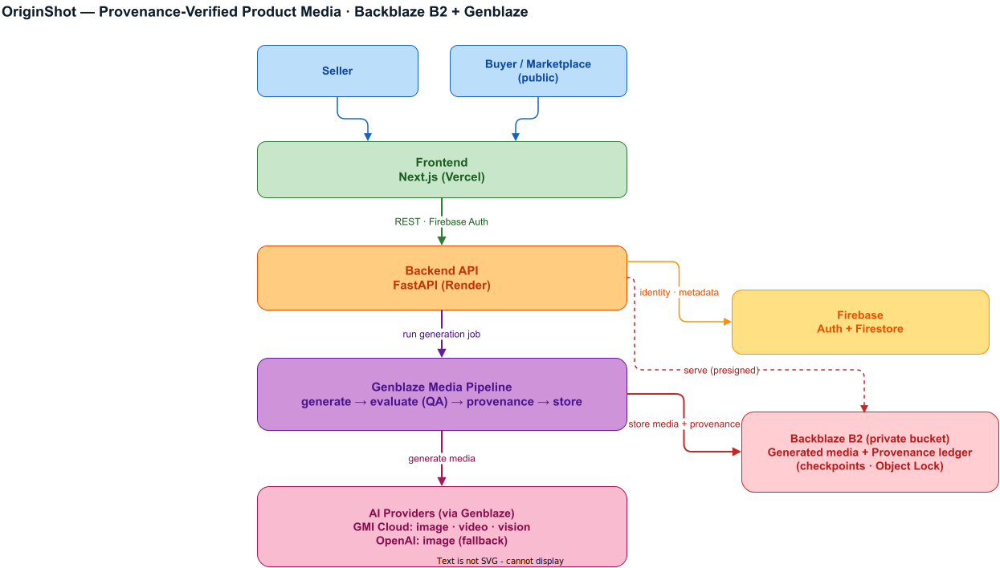

<div align="center">

# OriginShot — Prove What's Real, Generate the Rest

### *"Every AI product photo answers 'does this look good?' None of them answer 'is this the actual product?'"*

[](LICENSE)
[](https://backblaze-genblaze.devpost.com)
[](https://www.backblaze.com/cloud-storage)
[](https://github.com/backblaze-labs/genblaze)
[](https://fastapi.tiangolo.com)
[](https://nextjs.org)

**One phone photo in. A full marketplace-ready catalog out — where every generated file carries an embedded, cryptographically verifiable record of exactly how it was made.**

[**Live App**](https://originshot.vercel.app) · [**API**](https://originshot-api.onrender.com/healthz) · [**API Docs**](https://originshot-api.onrender.com/docs) · [**Verify a File**](https://originshot.vercel.app/verify) · [**Check a Listing**](https://originshot.vercel.app/check)

</div>

---

## The Problem

A seller lists a used camera lens. The photo is stunning — even lighting, perfect white background, no dust. It was also generated by AI from one dim phone snapshot, and the AI quietly removed a scratch that was really there. Nobody in that transaction can tell — not the buyer, not the marketplace, not the seller six months later in a dispute.

- Professional product photography costs **$25–150 per product**; a 150-SKU shop can't afford it.
- Every channel wants different dimensions — Amazon 2000×2000 pure white, Etsy 2000×1600 lifestyle, Social 4:5.
- The **EU AI Act** and a growing list of marketplaces now require disclosing AI-generated imagery.
- Existing AI photo tools solve the *first* problem and actively worsen the last two.

Tools that generate images answer *"does this look good?"* **OriginShot also answers *"is this the actual product?"*** — and proves it from the file's own bytes, offline, with no call back to our servers.

---

## The Idea in One Screen

Download any generated file, drop it into [`/verify`](https://originshot.vercel.app/verify), and the app re-derives the truth from the bytes alone — it never trusts its own database:

```
FILE  studio-cec2a305.png                                  ✓ MANIFEST PRESENT
──────────────────────────────────────────────────────────────────────────────
Integrity      ✓ VERIFIED       manifest canonical hash recomputed and matched
Content bound  ✓ BOUND          media bytes match the hash the manifest signed
Classification   AI-GENERATED · gemini-3-pro-image-preview (gmicloud-image)
Derived from   4b2b705dbcdd…    authentic original, SHA-256 anchored on upload
```

Now edit one pixel and drop it in again:

```
Content bound  ✗ BROKEN         media content no longer matches its signed hash
⚠ Tampered: carries an OriginShot manifest, but the media has been altered.
```

**That second result is the product.** A manifest you can forge or detach proves nothing. OriginShot binds the manifest *to the pixels*: `content_bound` recomputes the canonical hash by stripping the manifest back out of the container (PNG `iTXt`, MP4 `uuid`, JPEG APP1 XMP, WebP `XMP `) and comparing it to what the manifest committed to. See [`provenance.py`](backend/originshot_pipelines/provenance.py).

---

## Live Deployment

| Surface | URL |
|---|---|
| **Web app** | https://originshot.vercel.app |
| **REST API · Swagger** | https://originshot-api.onrender.com · [`/docs`](https://originshot-api.onrender.com/docs) |
| **Verify a file** (no login) | https://originshot.vercel.app/verify |
| **Check a listing** (no login) | https://originshot.vercel.app/check |
| **Resolve a dispute** (no login) | https://originshot.vercel.app/resolve |
| **Transparency log** (no login) | https://originshot.vercel.app/ledger |

> The API runs on Render's **free tier** (sleeps after ~15 min idle). A [keep-warm workflow](.github/workflows/keep-warm.yml) pings `/healthz` every 10 min; a cold start is ~50s. The public surfaces above need no account.

**Full API** — every endpoint is documented and runnable in the interactive Swagger UI at [`originshot-api.onrender.com/docs`](https://originshot-api.onrender.com/docs).

---

## Feature Tour

Every surface asks the same question — *is this the real product?* — from a different angle.

| Feature | What it does |
|---|---|
| **Studio** | One authentic photo → studio, lifestyle, on-model and variant shots + a hero video, each QA-scored against the original and provenance-embedded. |
| **[Transparency log](#the-transparency-log)** | Every manifest is appended to a published hash chain, so a seller who regenerated a shot 12 times until a scratch vanished leaves a trace no single file shows. |
| **Auditor** | A scheduled agent re-downloads stored media, re-verifies each file from its bytes, replays the chain against the last published checkpoint, and publishes a signed report to B2 — catching *silent* corruption. |
| **[Replay](backend/originshot_pipelines/replay.py)** | A manifest carries the full step spec (provider, model, prompt, seed), so one button re-runs the *original* spec — fallbacks stripped — not today's templates. Provenance you can execute. |
| **[Catalog Mode](https://originshot.vercel.app/studio/catalog)** | A folder of photos → one product each, run under bounded concurrency with per-item credit holds and honest partial results. Every SKU is still an ordinary job. |
| **[Catalog Intelligence](https://originshot.vercel.app/catalog)** | Semantic search (B2-stored text embeddings) + visual pHash search + cross-catalog fraud signals (*reused original*, *near-duplicate source*) — signals for review, never accusations. |
| **[Verify Anywhere](https://originshot.vercel.app/check)** | Buyer-side, account-free. A DCT perceptual hash survives the marketplace re-encode that destroys every cryptographic signal, so it recognises a re-compressed copy on a live Etsy/eBay listing. |
| **[Resolve](https://originshot.vercel.app/resolve)** | Account-free dispute report: was the listing photo honest, *and* is the delivered item the listed item (compared against the anchored original, not the AI shot). Outputs a signed, hash-anchored PDF. |
| **Voiceover** | GMI `GLM` writes the narration script → **OpenAI TTS** renders speech → muxed onto the hero video — a real multi-provider, multi-modality chain, with provenance embedded in the audio. |
| **Export pack** | A real ZIP: `verified/` masters (manifests intact), per-channel renditions at exact dimensions, a Certificate of Provenance PDF, and an EU-AI-Act-ready `disclosure.txt`. |

### The Transparency Log

A per-file manifest proves how *that* file was made; it says nothing about **what else was made**. So every manifest is appended to a hash chain whose head is published to B2 as a checkpoint:

```
entry_hash[n] = SHA256({ seq, prev_hash, subject_sha256, manifest_hash, kind, recorded_at })
```

Don't trust the [`/ledger`](https://originshot.vercel.app/ledger) page — it's served by the same server that wrote the log. [`scripts/verify_ledger.py`](scripts/verify_ledger.py) talks only to the public API, recomputes every hash locally (chain logic vendored, not imported), and catches a rewritten history against a previously published checkpoint:

```bash
python scripts/verify_ledger.py --save checkpoint.json     # today
python scripts/verify_ledger.py --against checkpoint.json  # a week later
```

Three defenses harden the published head, each degrading safely and named honestly where it falls short:

- **B2 Object Lock** — checkpoints and audit reports are written with compliance-mode retention, so B2 refuses to alter or delete them until expiry — *not even for the operator*. Off by default until the one-time bucket setup exists; when unavailable it publishes **unlocked** and says so, never claiming immutability it isn't delivering.
- **Ed25519 signing** — every checkpoint, audit and dispute report is signed over its content hash and verifies offline against the **public key committed in this repo**.
- **Bitcoin witness** — each checkpoint hash is anchored into Bitcoin via [OpenTimestamps](https://opentimestamps.org); the `.ots` proof is public at [`/api/ledger/checkpoint.ots`](https://originshot-api.onrender.com/api/ledger/checkpoint.ots), so anyone can `ots verify` against a chain the operator can't backdate. This is the first trust anchor here whose root isn't our own infrastructure.

**Honest gaps:** the Auditor is self-audit (the load-bearing check is the standalone verifier); a single key can't rule out a *split view* alone, though signing + Bitcoin make one detectable when two parties compare; and appends are best-effort, so absence is not evidence.

---

## How It Works

<p align="center">
  
</p>

```
  ONE PHONE PHOTO
         │  SHA-256 anchored as the AUTHENTIC source. EXIF/GPS stripped,
         ▼  magic-byte validated, bomb-guarded, re-encoded, stored on B2.
  ┌─────────────────────────── GENBLAZE PIPELINES ───────────────────────────┐
  │   studio · lifestyle · on-model · variants                                │
  │      └─▶ Pipeline().step(GMICloudImageProvider)  gemini-3-pro-image-preview│
  │   hero studio image                                                       │
  │      └─▶ Pipeline().step(GMICloudVideoProvider)  Kling-Image2Video-V2.1    │
  │              ↳ fallback: pixverse-v5.6-i2v, wan2.6-r2v                     │
  └──────────────────────────────────────────────────────────────────────────┘
         │  ObjectStorageSink(CONTENT_ADDRESSABLE) → identical bytes stored once
         ▼  → manifest embedded in the media, sidecar JSON on B2, Parquet export
  EXPORT PACK (.zip)   verified/ (manifests intact) · amazon/ etsy/ shopify/ ebay/
                       social/ (exact dimensions) · certificate.pdf · disclosure.txt
```

Each style is **isolated** — one provider failure yields a *partial* pack, never a total failure. Jobs report `done` / `partial` / `failed`.

---

## Built on Genblaze

Genblaze is the orchestration layer, not a single wrapped call:

- **Multi-step pipelines** — `Pipeline("originshot-studio").step(provider, …)` per style ([`originshot_pipelines/`](backend/originshot_pipelines/)).
- **Agentic evaluate → retry → store** — each image is QA-scored (Pillow checks + a vision "same product?" score against the original); on failure the checks are lifted into an `EvaluationResult`, its `.feedback` spliced into the prompt, and the style regenerated *once* as a fix ([`qa.py`](backend/originshot_pipelines/qa.py)).
- **Cross-provider, cross-modality** — one photo fans out to image + video on **GMI** while the voiceover routes narration to **OpenAI TTS**; the audio modality exists by a *provider swap* because GMI's own audio is unreachable ([issue 04](docs/genblaze-issues/04-gmi-audio-modality-unreachable.md)).
- **Fallback chains & lineage** — `fallback_models=[…]` on the video step; every asset records `parent_sha256` back to the authentic original.
- **Executable provenance** — [Replay](backend/originshot_pipelines/replay.py) reads a stored manifest back into a live `Pipeline` step.
- **Two autonomous agents that act on their own verdict** — the QA agent (refine-and-retry) and the scheduled Auditor (resample, re-verify, replay, sign, publish).
- **Provenance API** — `EmbedPolicy`, `PipelineResult.save(embed=True)`, `manifest.verify()`, `get_handler(mime).extract()`.

Model IDs and kwargs are **runtime-verified against the installed SDK** by [`tests/test_sdk_integration.py`](backend/tests/test_sdk_integration.py), so catalog drift fails CI, not production. SDK findings (incl. the GMI audio defect that *shaped* the voiceover feature) are filed in [`docs/genblaze-issues/`](docs/genblaze-issues/).

---

## Backblaze B2 — the Trust Anchor, Not Just the Blob Store

A transparency checkpoint kept only in our own database is worthless — the party you're asked to trust could rewrite it. Publishing each head to B2 under a content-addressed key gives it an existence independent of the app, and Object Lock makes it unrewritable *even by us*.

| B2 capability | Where OriginShot uses it |
|---|---|
| **Object Lock** (compliance retention) | Every checkpoint + audit report via `put_immutable` — history that *cannot* be rewritten, even with root credentials. |
| **Content-addressable keys** | Every asset/manifest/checkpoint keyed by the SHA-256 of its own bytes — physical dedup *and* a key that doubles as the integrity check `/verify` recomputes. |
| **Versioning** | Enabled on the bucket (the prerequisite Object Lock rides on). |
| **Private bucket + short-TTL presigned GET** | All media served only via 15-min presigned URLs; no public objects. |
| **Least-privilege bucket-scoped keys** | `S3StorageBackend.for_backblaze(...)`; the ledger key adds only `writeFileRetentions`. |
| **Genblaze `ObjectStorageSink` + `ParquetSink`** | The generation write path and analytics export — one backend for media, provenance and metadata. |

**What lives on B2:** authentic originals, generated + embedded media, sidecar manifests, `ledger/checkpoints/` (+ `.ots` Bitcoin proofs), `ledger/audits/`, `embeddings/<uid>.json` (semantic index), and the Parquet analytics export. The [Library](https://originshot.vercel.app/library) and [Catalog Intelligence](https://originshot.vercel.app/catalog) search all of it by style, hash prefix, meaning, or visual similarity.

---

## Providers & Models

Single source of truth: [`registry.py`](backend/originshot_pipelines/registry.py) — **only what the app actually calls today**, runtime-verified against our GMI account.

| Step | Provider | Model |
|---|---|---|
| Studio · Lifestyle · On-model · Variants | GMI Cloud (`gmicloud-image`) | `gemini-3-pro-image-preview` |
| Hero video (image → video) | GMI Cloud | `Kling-Image2Video-V2.1-Master` (fallbacks `pixverse-v5.6-i2v`, `wan2.6-r2v`) |
| QA evaluator (vision) | GMI Cloud (chat) | `x-ai/grok-4.5` |
| Listing copy + voiceover script | GMI Cloud (chat) | `zai-org/GLM-5.1-FP8` |
| Voiceover audio (text → speech) | **OpenAI** (`openai-tts`) | `gpt-4o-mini-tts` |

Chat models were chosen by **live probes on real product images**, not catalog presence — several catalog models 404, 429, or silently accept images they can't see. The QA evaluator was benchmarked (same mug diff shot 9/10, hue-rotated 3/10, different object 0/10, identical 10/10) before wiring. Nothing hard-depends on chat: QA falls back to a deterministic tier, listing copy returns an honest retry.

---

## Quick Start

**Prerequisites:** Python 3.11–3.13 (not 3.14+), Node 20+, Poetry.

```bash
git clone https://github.com/rogerjeasy/originshot.git && cd originshot
cp .env.example .env        # one env file, read by BOTH apps

cd backend && poetry env use 3.12 && poetry install
poetry run uvicorn app.main:app --reload      # http://localhost:8000/docs

cd ../frontend && npm install && npm run dev   # http://localhost:3000

cd ../backend && poetry run python -m pytest -q   # 380 passing
```

The backend runs **fully offline** — without B2 + a GMI key it uses an in-memory repo, local disk, and a generation mock, so the whole UX works with no cloud accounts. **Auth is always enforced** (no production bypass); signing in locally requires real Firebase web credentials in `.env`, and the sign-in page names any missing keys. Full env list with defaults in [`.env.example`](.env.example).

---

## Security

Designed in from week one; full threat model in [`docs/SECURITY.md`](docs/SECURITY.md).

- Every route authenticated; `uid` derived **only** from a verified Firebase token.
- Per-user isolation in the backend **and** deny-by-default Firestore rules (IDOR-tested).
- Secrets server-side only; private B2 bucket, least-privilege key, short-TTL presigned URLs.
- Uploads: magic-byte validation, size/pixel caps, bomb guards, EXIF/GPS stripping.
- Denial-of-wallet: per-user daily quotas + IP rate limiting (keyed on left-most `X-Forwarded-For`).
- The one caller-supplied-URL fetcher (`/check`) goes through a single SSRF-hardened choke point ([`app/fetch.py`](backend/app/fetch.py)): scheme/port allowlist, every resolved IP checked against private/loopback/link-local/CGNAT, redirects re-validated per hop.
- CSP, HSTS, strict CORS allowlist (no wildcard origins). No secrets in the repo (verified across git history).

---

## Known Limitations

Stated plainly, because a submission that hides these is worse than one that names them.

- **Render free tier** sleeps after ~15 min; first request cold-starts ~50s.
- **No image-model fallback** — the SDK's advertised `seededit`/`reve-*` models 404 against our account's request-queue API (the `validate_model` probe wrongly reports them fine), so the chain is wired-and-empty rather than fake.
- **Marketplace renditions drop the embedded manifest** (re-encoding to exact dimensions) — which is why `verified/` ships the untouched masters alongside.
- **Standalone audio has no `content_bound`** — the strip-and-rehash hash covers PNG/MP4/JPEG/WebP, not raw audio, so the narration clip is *present + verified*; the narrated MP4 closes the gap by being an MP4.
- **Cost figures are dual-sourced** — the provider-billed total (settled through the ledger) plus a labeled list-price estimate for runs predating billing data. See [`docs/BENCHMARKS.md`](docs/BENCHMARKS.md).
- **Provider credit is exhaustible** — GMI returns `402 Insufficient credits` and generation fails cleanly. Top up before a demo.

---

## License

MIT — see [LICENSE](LICENSE).

<div align="center">

**Built for the [Backblaze Generative Media Hackathon](https://backblaze-genblaze.devpost.com)** · Generate with Genblaze. Store on Backblaze B2.

</div>
