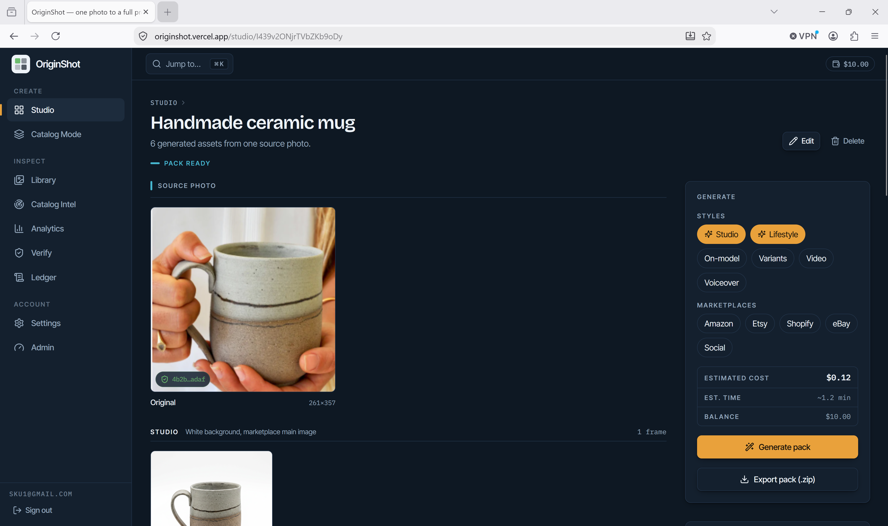
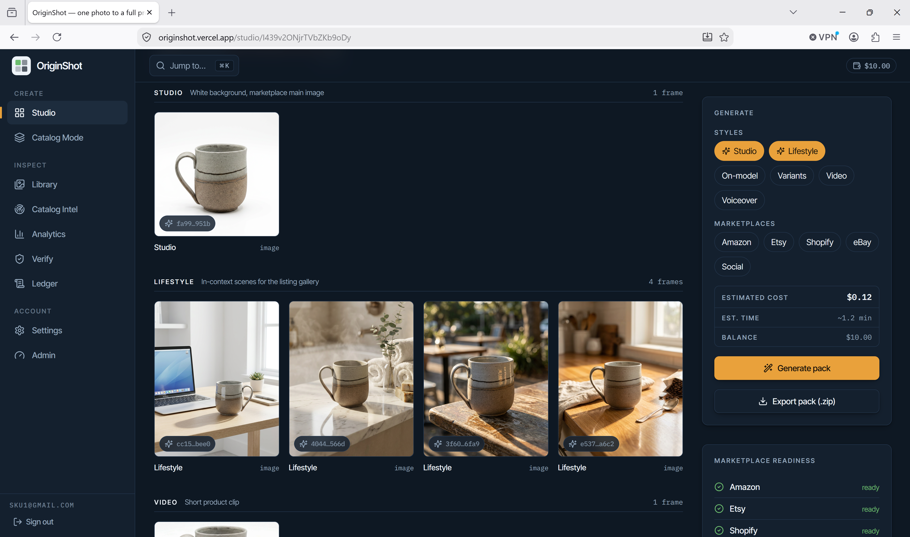
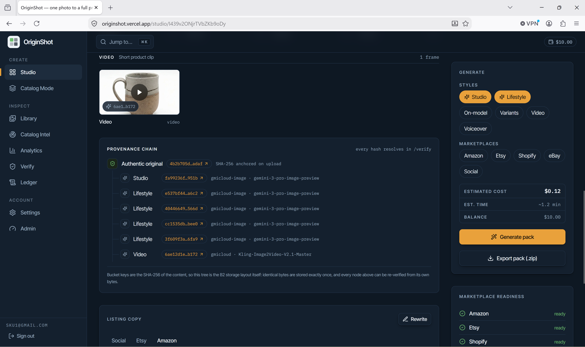
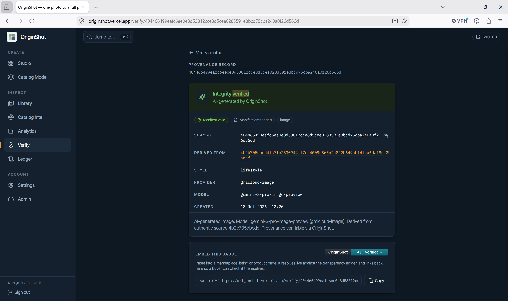
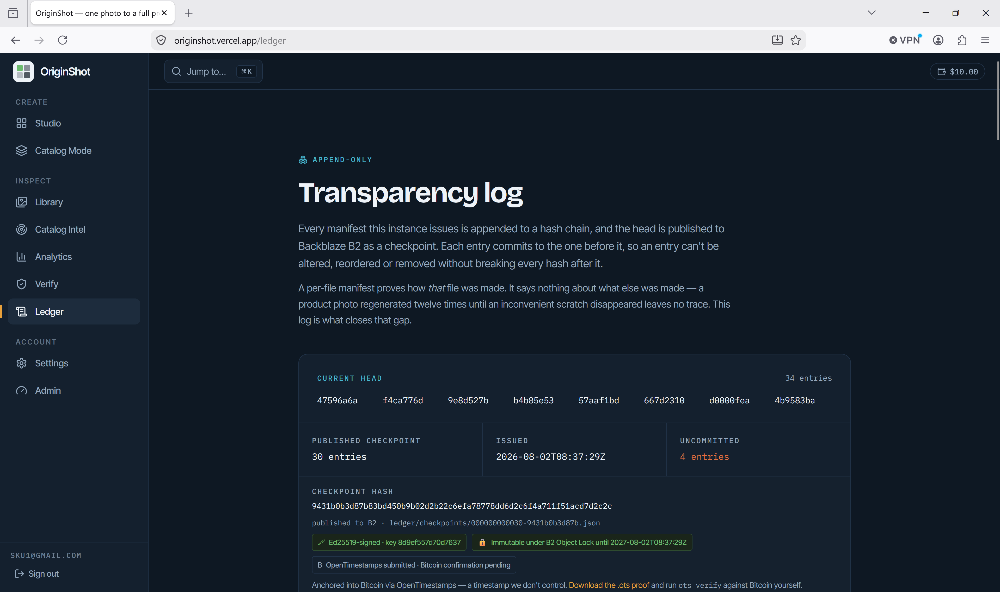
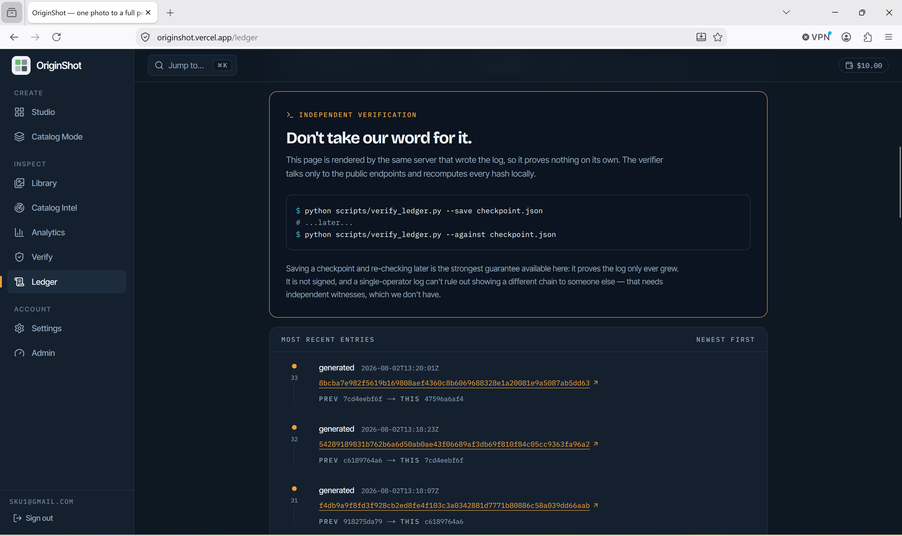
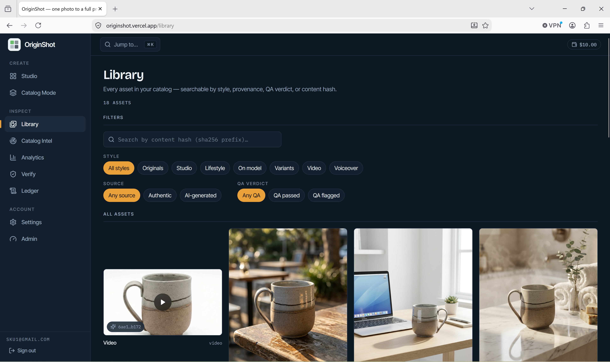
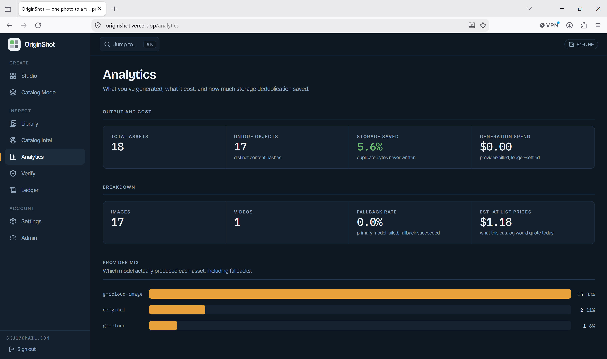
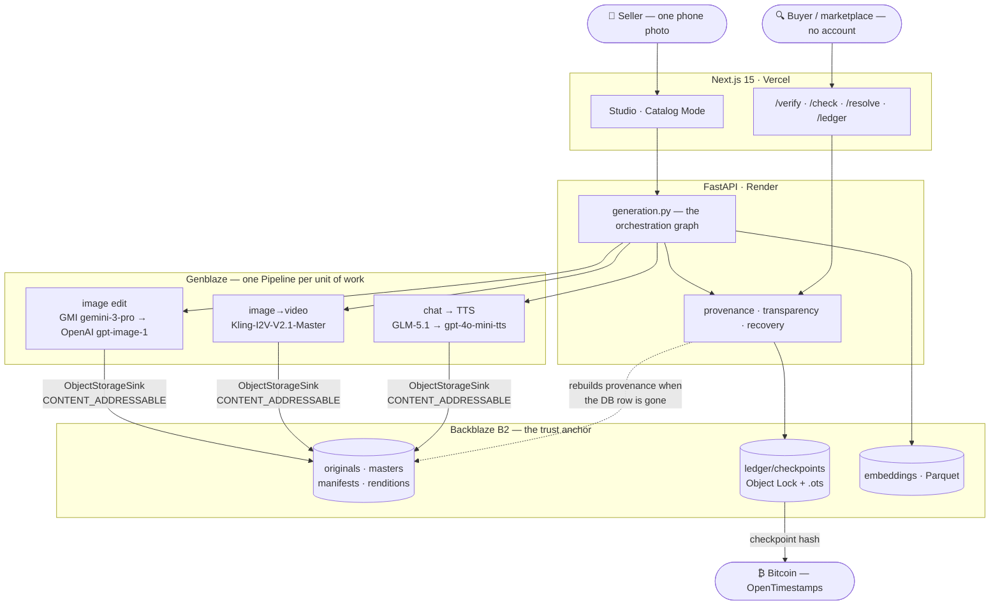

<div align="center">

# OriginShot — Prove What's Real, Generate the Rest

### *"Every AI product photo answers 'does this look good?' None of them answer 'is this the actual product?'"*

[](https://github.com/rogerjeasy/originshot/actions/workflows/tests.yml)
[](LICENSE)
[](https://backblaze-genblaze.devpost.com)
[](https://www.backblaze.com/cloud-storage)
[](https://github.com/backblaze-labs/genblaze)
[](https://fastapi.tiangolo.com)
[](https://nextjs.org)

**One phone photo in. A full marketplace-ready catalog out — where every generated file carries an embedded, cryptographically verifiable record of exactly how it was made.**

[**Live App**](https://originshot.vercel.app) · [**API Docs**](https://originshot-api.onrender.com/docs) · [**Verify a File**](https://originshot.vercel.app/verify) · [**Check a Listing**](https://originshot.vercel.app/check) · [**Transparency Log**](https://originshot.vercel.app/ledger)

</div>

---

## The Problem

A seller lists a used camera lens. The photo is stunning — even lighting, perfect white background,
no dust. It was also generated by AI from one dim phone snapshot, and the AI quietly removed a
scratch that was really there. Nobody in that transaction can tell — not the buyer, not the
marketplace, not the seller six months later in a dispute.

- Professional product photography costs **$25–150 per product**; a 150-SKU shop can't afford it.
- Every channel wants different dimensions — Amazon 2000×2000 pure white, Etsy 2000×1600 lifestyle, Social 4:5.
- The **EU AI Act** and a growing list of marketplaces now require disclosing AI-generated imagery.
- Existing AI photo tools solve the *first* problem and actively worsen the last two.

| | Existing AI photo tools | OriginShot |
|---|---|---|
| **Cost per product** | $25–150 studio, or a subscription | ~$0.74 estimated provider cost per 7-asset pack |
| **"Is this the real product?"** | No answer | Vision QA scores identity against the original; a failing style regenerates with the specific correction |
| **After the file leaves your machine** | Nothing | Manifest bound to the pixels; tampering reports `BROKEN` |
| **After a marketplace re-encodes it** | Nothing | Perceptual tier still recognises the copy — measured **0/64** |
| **What else did the seller generate?** | Invisible | Append-only hash chain; 12 regenerations until a scratch vanished leaves a trace |
| **Disclosure compliance** | A checkbox you tick | A record that resolves, plus an EU-AI-Act-ready `disclosure.txt` in the export |
| **Who can check it?** | You, in their dashboard | Anyone, offline, from the bytes — including your buyer |

---

## What Makes This Different

Plenty of tools generate product media and store it on B2. Generating the image is the easy half.
The half almost nobody builds is **the negative result** — the app telling you, confidently, *"this
file is not what it claims to be."*

- **The failure case is the product.** A manifest you can forge or detach proves nothing. OriginShot
  binds the manifest **to the pixels**: `content_bound` recomputes the canonical hash by stripping
  the manifest back out of the container (PNG `iTXt`, MP4 `uuid`, JPEG APP1 XMP, WebP `XMP `) and
  comparing it to what the manifest committed to. Flip one byte and verification says so.
- **It answers to a stranger, offline.** Verification recomputes provenance from the bytes alone —
  never from our database. [`scripts/verify_ledger.py`](scripts/verify_ledger.py) talks only to the
  public API, vendors the chain logic rather than importing it, and will catch this project
  rewriting its own history.
- **It survives the marketplace.** Etsy and eBay re-encode every upload and strip the manifest,
  killing every cryptographic signal. A DCT perceptual hash still recognises the re-compressed copy
  and traces it home.
- **The trust anchors are not ours.** Checkpoints are written under **B2 Object Lock** (compliance
  retention — unrewritable even by the operator), **Ed25519-signed** against a key committed in this
  repo, and **anchored into Bitcoin** via OpenTimestamps.
- **It states where it falls short.** Every limitation in [Known Limitations](#known-limitations) is
  also surfaced in the app's own output. A dispute report that overclaims is worse than none.

---

## Live Deployment

| Surface | URL | Account needed |
|---|---|:---:|
| **Web app** | https://originshot.vercel.app | — |
| **REST API** | https://originshot-api.onrender.com | — |
| **Swagger / OpenAPI** | https://originshot-api.onrender.com/docs | — |
| **Verify a file** | https://originshot.vercel.app/verify | no |
| **Check a listing** | https://originshot.vercel.app/check | no |
| **Resolve a dispute** | https://originshot.vercel.app/resolve | no |
| **Transparency log** | https://originshot.vercel.app/ledger | no |
| **Studio / Catalog** | https://originshot.vercel.app/studio | yes |

> The API runs on Render's **free tier** and sleeps after ~15 min idle. A
> [keep-warm workflow](.github/workflows/keep-warm.yml) pings `/healthz` every 10 minutes; a cold
> start is ~50s. Everything after the first request is fast.

The sign-in page carries a one-click **"Explore a pre-loaded demo account"** button — a public,
pre-seeded workspace with generated packs, safe to break.

---

## Screenshots

All captured from the live app — no mockups.

| Upload → pick styles | Pack delivered |
|:---:|:---:|
|  |  |
| One anchored photo in, styles + marketplaces picked, cost quoted up front | Studio + 4 lifestyle frames back, each hash-tagged; Amazon/Etsy/Shopify marked ready |

| Provenance chain, per asset | Verify a file |
|:---:|:---:|
|  |  |
| Every generated asset traced back to the anchored original — provider · model per step | Anyone, no login: integrity verified, provider/model/lineage, embeddable badge |

| Transparency log — chain head | Transparency log — verify it yourself |
|:---:|:---:|
|  |  |
| Head, signature, Object Lock retention, OpenTimestamps Bitcoin anchor | `scripts/verify_ledger.py` — recomputes every hash locally, vendors the chain logic |

| Library | Analytics |
|:---:|:---:|
|  |  |
| Every asset, filterable by style / source / QA verdict, searchable by hash | What was generated, what it cost, and which provider actually served it |

---

## The Marquee Result

A live response from the public `/check` endpoint. The input was a `.webp` whose embedded manifest
had been destroyed by re-encoding — exactly what a marketplace does to every photo it accepts:

```jsonc
POST /api/check   url=https://originshot.vercel.app/demo/studio-01.webp

{
  "source": "url_image",
  "images_scanned": 1,
  "result": {
    "sha256":   "0a0b1d384049b64ae82bdc5f82f13d8056ba44386a6201f05e613716f0a60ee2",
    "found":    false,          // the cryptographic path is dead — manifest stripped
    "embedded": false,
    "perceptual": {
      "matched_sha256": "11bfce586cc893088f4161379d2bc8f62f4752d7c9497bd2753b455c5b08de58",
      "distance":       0,      // 0/64 bits — recognised through the re-encode
      "strong":         true,
      "provider":       "openai-dalle",
      "model":          "gpt-image-1",
      "parent_sha256":  "05993b99f9affecea0db9cb1fbc840ec5cad1a24d018b8bdfea9744ddceeb475",
      "matched_in_ledger": true
    },
    "disclosure": "No provenance manifest survives in this file (marketplaces re-encode images
                   and strip it), but it closely matches a known OriginShot asset (11bfce586cc8…,
                   perceptual distance 0/64). It traces to authentic original 05993b99f9af…
                   This is a visual-similarity match — evidence, not a cryptographic guarantee."
  }
}
```

The disclosure downgrades its own claim: it found the file, named the model that made it, traced it
to the seller's authentic photo — and still reports this tier as evidence rather than proof. That
distinction is what makes the cryptographic tier believable.

---

## How It Works


```mermaid
flowchart TB
    seller(["📱 Seller — one phone photo"])
    buyer(["🔍 Buyer / marketplace — no account"])

    subgraph web["Next.js 15 · Vercel"]
        studio["Studio · Catalog Mode"]
        public["/verify · /check · /resolve · /ledger"]
    end

    subgraph api["FastAPI · Render"]
        gen["generation.py — the orchestration graph"]
        prov["provenance · transparency · recovery"]
    end

    subgraph gb["Genblaze — one Pipeline per unit of work"]
        img["image edit<br/>GMI gemini-3-pro → OpenAI gpt-image-1"]
        vid["image→video<br/>Kling-I2V-V2.1-Master"]
        aud["chat → TTS<br/>GLM-5.1 → gpt-4o-mini-tts"]
    end

    subgraph b2["Backblaze B2 — the trust anchor"]
        media[("originals · masters<br/>manifests · renditions")]
        ledger[("ledger/checkpoints<br/>Object Lock + .ots")]
        idx[("embeddings · Parquet")]
    end

    btc(["₿ Bitcoin — OpenTimestamps"])

    seller --> studio --> gen
    gen --> img & vid & aud
    img & vid & aud -->|"ObjectStorageSink<br/>CONTENT_ADDRESSABLE"| media
    gen --> prov --> ledger
    ledger -->|checkpoint hash| btc
    gen --> idx
    buyer --> public --> prov
    prov -.->|"rebuilds provenance when<br/>the DB row is gone"| media
```

| Step | What happens |
|---|---|
| **1 · Anchor** | The upload is SHA-256 hashed as the authentic source. EXIF/GPS stripped, magic-byte validated, bomb-guarded, re-encoded, stored on B2. |
| **2 · Fan out** | Genblaze pipelines produce studio, lifestyle, on-model and variant shots, then a hero video from the delivered studio frame. |
| **3 · Evaluate** | Each image is QA-scored (Pillow checks + a vision "same product?" score). A failing style regenerates **once** with the specific correction spliced into the prompt. |
| **4 · Bind** | The manifest is embedded in the media, a sidecar JSON is written to B2, and the entry is appended to the transparency chain. |
| **5 · Export** | A ZIP with `verified/` masters, per-channel renditions at exact dimensions, a Certificate of Provenance PDF, and `disclosure.txt`. |

Each style is **isolated** — one provider failure yields a *partial* pack, never a total failure.
Jobs report `done` / `partial` / `failed`. Full diagrams:
[`ARCHITECTURE.svg`](docs/ARCHITECTURE.svg) · [`B2_DATA_ORCHESTRATION.svg`](docs/B2_DATA_ORCHESTRATION.svg).

---

## Verified, Not Claimed

Every row was re-checked against the live deployment and the current commit, and is reproducible
with the command beside it.

| Claim | Result | Reproduce |
|---|---|---|
| Test suite | **431 passed, 1 skipped** | `cd backend && poetry run pytest -q` |
| Frontend type safety | **clean (exit 0)** | `cd frontend && npx tsc --noEmit` |
| Transparency chain replays | **30 entries, head reproduced** | `python scripts/verify_ledger.py` |
| Checkpoint signature | **verifies against the repo public key** `8d9ef557…` | same command |
| B2 Object Lock | **active — `retained_until: 2027-08-01`** | `curl …/api/ledger/checkpoint` |
| Bitcoin anchor | **submitted, 2 calendars, 408-byte proof** | `curl -sO …/api/ledger/checkpoint.ots && ots verify checkpoint.ots` |
| Scheduled auditor | **25/25 assets passed, chain consistent** | `curl …/api/ledger/audit` |
| In-the-wild recognition | **distance 0/64** through a stripped manifest | `curl -F "url=…" …/api/check` |
| Multimodal in production | **audio + narrated video** in the ledger (`openai-tts`, `ffmpeg-mux`) | `curl …/api/ledger/entries` |
| SDK defects filed upstream | **6 open** — [`#248`](https://github.com/backblaze-labs/genblaze/issues/248)–[`#253`](https://github.com/backblaze-labs/genblaze/issues/253) | GitHub |

Model IDs and kwargs are runtime-verified against the installed SDK by
[`tests/test_sdk_integration.py`](backend/tests/test_sdk_integration.py), so catalog drift fails CI
rather than production.

---

## Key Features

| Feature | What it does |
|---|---|
| **Studio** | One authentic photo → studio, lifestyle, on-model and variant shots plus a hero video, each QA-scored against the original and provenance-embedded. |
| **Transparency log** | Every manifest is appended to a published hash chain, so a seller who regenerated a shot twelve times until a scratch vanished leaves a trace no single file shows. |
| **Auditor** | A scheduled agent re-downloads stored media, re-verifies each file from its bytes, replays the chain against the last published checkpoint, and publishes a signed report to B2 — catching *silent* corruption. |
| **Replay** | A manifest carries the full step spec (provider, model, prompt, seed), so one button re-runs the *original* spec — fallbacks stripped — not today's templates. |
| **Catalog Mode** | A folder of photos → one product each, under bounded concurrency with per-item credit holds and honest partial results. |
| **Catalog Intelligence** | Semantic search (B2-stored embeddings) + visual pHash search + cross-catalog fraud signals (*reused original*, *near-duplicate source*) — signals for review, never accusations. |
| **Verify Anywhere** | Buyer-side and account-free. A DCT perceptual hash survives the marketplace re-encode that destroys every cryptographic signal. |
| **Resolve** | Account-free dispute report: was the listing photo honest, *and* is the delivered item the listed item (compared against the anchored original, not the AI shot). Outputs a signed, hash-anchored PDF. |
| **Voiceover** | GMI `GLM` writes the narration script → **OpenAI TTS** renders speech → muxed onto the hero video, with provenance embedded in the audio. |
| **Export pack** | A real ZIP: `verified/` masters with manifests intact, per-channel renditions, a Certificate of Provenance PDF, and an EU-AI-Act-ready `disclosure.txt`. |

### The Transparency Log

A per-file manifest proves how *that* file was made; it says nothing about **what else was made**.
Every manifest is therefore appended to a hash chain whose head is published to B2 as a checkpoint:

```
entry_hash[n] = SHA256({ seq, prev_hash, subject_sha256, manifest_hash, kind, recorded_at })
```

The [`/ledger`](https://originshot.vercel.app/ledger) page is served by the same server that wrote
the log, so it proves nothing on its own. [`scripts/verify_ledger.py`](scripts/verify_ledger.py)
recomputes every hash locally and catches a rewritten history against a previously saved checkpoint:

```bash
python scripts/verify_ledger.py --save checkpoint.json     # today
python scripts/verify_ledger.py --against checkpoint.json  # a week later
```

| Defense | Guarantee | Degrades to |
|---|---|---|
| **B2 Object Lock** | Compliance retention — B2 refuses to alter or delete a checkpoint until expiry, *not even for the operator* | Publishes **unlocked** and says so |
| **Ed25519 signing** | Every checkpoint, audit and dispute report verifies offline against the public key committed in this repo | Publishes unsigned and reports `state` |
| **Bitcoin witness** | Each checkpoint hash anchored via [OpenTimestamps](https://opentimestamps.org) — a root the operator does not control | Reports `submitted`, not `confirmed`, until a block lands |

**Honest gaps:** the Auditor is self-audit (the load-bearing check is the standalone verifier); a
single signing key cannot rule out a *split view* alone, though signing plus Bitcoin make one
detectable when two parties compare; and appends are best-effort, so absence is not evidence.

---

## Built on Genblaze

Genblaze is the orchestration layer, not a single wrapped call.

| Capability | Where |
|---|---|
| **A pipeline per unit of work** | `Pipeline("originshot-studio").step(provider, …)` per style — [`originshot_pipelines/`](backend/originshot_pipelines/) |
| **Agentic evaluate → retry → store** | QA checks lifted into an `EvaluationResult`, its `.feedback` spliced into the prompt, the style regenerated once as a fix — [`qa.py`](backend/originshot_pipelines/qa.py) |
| **Cross-provider, cross-modality** | Image + video on GMI; narration routed to OpenAI TTS — four modalities, two providers |
| **Fallback chains & lineage** | `fallback_models=[…]` on the video step; every asset records `parent_sha256` back to the authentic original |
| **Executable provenance** | [`replay.py`](backend/originshot_pipelines/replay.py) reads a stored manifest back into a live `Pipeline` step |
| **Two autonomous agents** | The QA agent (refine-and-retry) and the scheduled Auditor (resample, re-verify, replay, sign, publish) |
| **Provenance API** | `EmbedPolicy`, `PipelineResult.save(embed=True)`, `manifest.verify()`, `get_handler(mime).extract()` |

### Where the orchestration lives

**Every `Pipeline` in this repo has exactly one `.step()`.** A Genblaze pipeline is the *unit of
work* — one provider call, wrapped in the SDK's provenance, sink and fallback machinery. The graph
*between* those units lives in [`_run_genblaze`](backend/app/generation.py), and the split is
deliberate.

The run is a real dependency graph: studio must finish before the hero video, which consumes the
delivered studio frame; the voiceover then routes a GMI-written script through OpenAI TTS and muxes
the result onto that video. Four things happen *between* nodes that a single linear pipeline cannot
express:

- **A QA gate that re-runs a node it just evaluated.** Downstream must consume *the attempt QA
  kept* — a studio retry repoints the hero frame so the video derives from the image that shipped,
  not the one that was rejected.
- **Per-node failure isolation.** One pipeline that raises loses the whole run; here a failed style
  is caught and the rest still execute, which is what makes a job honestly `partial`.
- **Cross-provider failover.** `fallback_models=` retries other models on the *same* provider, so it
  cannot route around a 402 covering an entire account. Falling from GMI to OpenAI mid-run is
  therefore this app's job — [`providers.py`](backend/originshot_pipelines/providers.py).
- **Steps the SDK doesn't own.** Credit holds settle against `Step.cost_usd` where the provider
  reports one and a labelled list-price estimate where it doesn't
  ([`pricing.py`](backend/app/pricing.py)); a [reaper](backend/app/reaper.py) settles jobs whose
  *process* died; the final mux is ffmpeg, recorded as `ffmpeg-compositor` rather than dressed up as
  a model call.

Six SDK defects found while building this are filed in
[`docs/genblaze-issues/`](docs/genblaze-issues/) and upstream as
[`#248`–`#253`](https://github.com/backblaze-labs/genblaze/issues/248). One of them *shaped a
feature*: GMI's audio modality is unreachable, which is why the voiceover routes to OpenAI TTS.

---

## Backblaze B2 — the Trust Anchor, Not Just the Blob Store

A transparency checkpoint kept only in the app's own database is worthless — the party you are asked
to trust could rewrite it. Publishing each head to B2 under a content-addressed key gives it an
existence independent of the app, and Object Lock makes it unrewritable even by the operator.

| B2 capability | Where it is used |
|---|---|
| **Object Lock** (compliance retention) | Every checkpoint + audit report via `put_immutable` — history that cannot be rewritten, even with root credentials |
| **Content-addressable keys** | `assets/<sha[:2]>/<sha[2:4]>/<sha><ext>` — physical dedup *and* a key that doubles as the integrity check `/verify` recomputes |
| **Versioning** | Enabled on the bucket (the prerequisite Object Lock rides on) |
| **Private bucket + short-TTL presigned GET** | All media served via 15-minute presigned URLs; no public objects |
| **Least-privilege bucket-scoped keys** | `S3StorageBackend.for_backblaze(...)`; the ledger key adds only `writeFileRetentions` |
| **Genblaze `ObjectStorageSink` + `ParquetSink`** | The generation write path and the analytics export — one backend for media, provenance and metadata |
| **Provenance that outlives the database** | Every log entry commits to its manifest's B2 key, so verification rebuilds the record from object storage when the row is gone |

### The database is not the source of truth

This was proven by accident. The transparency log is append-only and the asset table is not, so
deleting a product left **6 of 30** production entries describing files the database no longer knew
about. Verification answered `found: false` — contradicting the instance's own signed, checkpointed
log.

It doesn't need the database. `manifest_hash` is one of the fields an entry's hash is taken over, so
the chain already commits to *where the manifest lives on B2*:

```
Bitcoin (OpenTimestamps) ─┐
Ed25519 signature ────────┴─▶ checkpoint ─▶ head ─▶ entry_hash ─▶ manifest_hash (B2 key)
```

[`app/recovery.py`](backend/app/recovery.py) follows that pointer, re-reads the manifest from B2 and
re-verifies it — recovering provider, model, lineage and timestamp with **no database row
involved**. All five recoverable entries now resolve, each passing its own integrity check and
tracing to the same anchored original, and the answer reports `"resolved_from": "b2-manifest"`.

Stated as carefully as the rest: the chain commits to the manifest's *location*, not a hash of its
bytes, and sidecar manifests are not under Object Lock — so this catches corruption and a lost
database, not a determined operator re-issuing the object. A hash alone can never set
`content_bound`; only posting the file can. The sixth entry has no manifest pointer at all and is
reported as exactly that.

**What lives on B2:** authentic originals, generated and embedded media, sidecar manifests,
`ledger/checkpoints/` (plus `.ots` Bitcoin proofs), `ledger/audits/`, `embeddings/<uid>.json`, and
the Parquet analytics export.

---

## Providers & Models

Single source of truth: [`registry.py`](backend/originshot_pipelines/registry.py) — only what the app
actually calls today, runtime-verified against a real account.

| Step | Provider (preferred → failover) | Model |
|---|---|---|
| Studio · Lifestyle · On-model · Variants | GMI Cloud (`gmicloud-image`) → **OpenAI** (`openai-dalle`) | `gemini-3-pro-image-preview` → `gpt-image-1` |
| Hero video (image → video) | GMI Cloud | `Kling-Image2Video-V2.1-Master` (fallbacks `pixverse-v5.6-i2v`, `wan2.6-r2v`) |
| QA evaluator (vision) | GMI Cloud (chat) | `x-ai/grok-4.5` |
| Listing copy + voiceover script | GMI Cloud (chat) | `zai-org/GLM-5.1-FP8` |
| Voiceover audio (text → speech) | **OpenAI** (`openai-tts`) | `gpt-4o-mini-tts` |

The image row is a chain, not a single vendor, and the failover is not hypothetical: the pack on the
landing page was served **entirely by `gpt-image-1`** because GMI's image queue was out of credit
when it ran. Each frame credits whichever provider actually answered. Live provider mix across all
production assets: **34 `gmicloud-image` · 12 `openai-dalle` · 2 `gmicloud` (video) · 2 `openai-tts`
· 1 `ffmpeg-compositor`**.

Chat models were selected by live probes on real product images, not catalog presence — several
catalog models 404, 429, or silently accept images they cannot see. The QA evaluator was benchmarked
(same mug different shot 9/10, hue-rotated 3/10, different object 0/10, identical 10/10) before
being wired in. Nothing hard-depends on chat: QA falls back to a deterministic tier and listing copy
returns an honest retry.

---

## Tech Stack

| Layer | Technology |
|---|---|
| **Generative orchestration** | Genblaze (`genblaze` ≥ 0.4.3, `genblaze-core`, `genblaze-gmicloud`, `genblaze-openai`) |
| **Object storage** | Backblaze B2 (S3-compatible) via boto3 — Object Lock, versioning, presigned GET |
| **Models** | GMI Cloud (Gemini 3 Pro image, Kling I2V, Grok 4.5 vision, GLM-5.1) · OpenAI (`gpt-image-1`, `gpt-4o-mini-tts`) |
| **API** | FastAPI · Pydantic v2 · Uvicorn · `slowapi` rate limiting · SSE job streaming |
| **Web** | Next.js 15 (App Router) · React 19 · Tailwind · Radix UI · framer-motion |
| **Auth & metadata** | Firebase Auth + Firestore (deny-by-default rules, IDOR-tested) |
| **Provenance & trust** | Ed25519 signing · OpenTimestamps (Bitcoin) · B2 Object Lock · DCT perceptual hashing |
| **Media** | Pillow · ffmpeg (`imageio-ffmpeg`) for the narration mux · `fpdf2` for certificates |
| **Analytics** | Genblaze `ParquetSink` → B2 · DuckDB |
| **Hosting** | Vercel (web) · Render (API) · GitHub Actions (tests, keep-warm, scheduled auditor) |

---

## Quick Start

**Prerequisites:** Python 3.11–3.13 (not 3.14+), Node 20+, Poetry.

```bash
git clone https://github.com/rogerjeasy/originshot.git && cd originshot
cp .env.example .env        # one env file, read by BOTH apps

cd backend && poetry env use 3.12 && poetry install
poetry run uvicorn app.main:app --reload      # http://localhost:8000/docs

cd ../frontend && npm install && npm run dev   # http://localhost:3000

cd ../backend && poetry run python -m pytest -q   # 431 passing
```

The backend runs **fully offline** — without B2 and a provider key it uses an in-memory repo, local
disk, and a generation mock, so the whole UX works with no cloud accounts. **Auth is always
enforced** (no production bypass); signing in locally requires real Firebase web credentials in
`.env`, and the sign-in page names any missing keys.

---

## API Reference

Full interactive spec at [`/docs`](https://originshot-api.onrender.com/docs). Public routes need no
token; the rest require a Firebase ID token.

| Route | Method | Purpose | Public |
|---|---|---|:---:|
| `/api/verify/{sha256}` | GET | Look up provenance by content hash | ✅ |
| `/api/verify` | POST | Verify uploaded **bytes** — the only path that can set `content_bound` | ✅ |
| `/api/check` | POST | Recognise a listing URL or photo after a re-encode (perceptual tier) | ✅ |
| `/api/resolve` | POST | Generate a signed dispute-evidence report | ✅ |
| `/api/ledger` · `/entries` · `/proof/{sha}` | GET | The transparency chain and per-entry inclusion proofs | ✅ |
| `/api/ledger/checkpoint` · `.ots` · `/pubkey` | GET | Published head, Bitcoin proof, signing public key | ✅ |
| `/api/badge/{sha256}.svg` | GET | Embeddable provenance badge for a listing | ✅ |
| `/api/skus` · `/api/skus/{id}` | GET POST PATCH DELETE | Product CRUD | — |
| `/api/skus/{id}/generate` | POST | Start a generation job | — |
| `/api/jobs/{id}` · `/stream` | GET | Job status; SSE progress stream | — |
| `/api/skus/{id}/export` | POST | Build the marketplace ZIP | — |
| `/api/skus/{id}/assets/{id}/replay` | POST | Re-run an asset from its stored manifest | — |
| `/api/batches` | GET POST | Catalog Mode runs | — |
| `/api/library/search` · `/similar` | GET | Semantic and visual search | — |
| `/healthz` | GET | Dependency health, signing state, queue mode | ✅ |

---

## Repository Layout

```
originshot/
├── backend/
│   ├── app/                        # FastAPI application layer
│   │   ├── generation.py           #   THE ORCHESTRATION GRAPH — styles, QA gates, retries
│   │   ├── transparency.py         #   append-only hash chain + checkpoint publication
│   │   ├── recovery.py             #   rebuild provenance from B2 when the DB row is gone
│   │   ├── witness.py              #   OpenTimestamps → Bitcoin anchoring
│   │   ├── signing.py              #   Ed25519 over checkpoints / audits / dispute reports
│   │   ├── auditor.py              #   scheduled resample → re-verify → replay → sign → publish
│   │   ├── reaper.py               #   settles jobs whose PROCESS died (free-tier OOM)
│   │   ├── catalog_intel.py        #   semantic + visual search, reused-original signals
│   │   ├── fetch.py                #   the one SSRF-hardened caller-supplied-URL choke point
│   │   ├── storage.py              #   B2 (private, presigned, put_immutable) / local dev
│   │   ├── pricing.py              #   billable_cost — provider-billed vs labelled estimate
│   │   └── api/                    #   19 route modules (verify, check, ledger, resolve, …)
│   ├── originshot_pipelines/       # Genblaze layer — one Pipeline per unit of work
│   │   ├── registry.py             #   SINGLE SOURCE OF TRUTH for providers/models
│   │   ├── providers.py            #   cross-provider image chain + 2 SDK workarounds
│   │   ├── provenance.py           #   embed / extract / content-binding
│   │   ├── qa.py                   #   deterministic + VLM tiers → EvaluationResult
│   │   ├── perceptual.py           #   DCT pHash — the in-the-wild tier
│   │   ├── replay.py               #   stored manifest → live Pipeline step
│   │   ├── voiceover.py            #   GLM script → OpenAI TTS → ffmpeg mux
│   │   └── studio·lifestyle·onmodel·variants·video·resolve·certificate·presets
│   └── tests/                      # 431 passing
├── frontend/
│   ├── app/                        # 20 routes — (app)/ authed · public /verify /check /ledger
│   ├── components/studio/          #   orchestration-trace · job-progress · lineage-graph
│   ├── components/ledger/          #   chain-entries · chain-head · verify-yourself
│   └── lib/                        # api · stream-job (SSE) · use-session
├── scripts/
│   ├── verify_ledger.py            # THE INDEPENDENT VERIFIER — vendors chain logic
│   ├── backfill-phash.py           # rebuild the pHash index from bytes already on B2
│   └── seed-demo-account.py        # the shared demo account
├── docs/
│   ├── SECURITY.md · BENCHMARKS.md · ARCHITECTURE.svg · B2_DATA_ORCHESTRATION.svg
│   └── genblaze-issues/            # 6 SDK write-ups, filed upstream as #248–253
└── infra/ · render.yaml · .github/workflows/
```

---

## Environment Variables

One `.env` at the repo root is read by **both** apps. Full list with defaults in
[`.env.example`](.env.example).

| Variable | Purpose |
|---|---|
| `B2_KEY_ID` · `B2_APP_KEY` · `B2_BUCKET` · `B2_REGION` · `B2_ENDPOINT_URL` | Backblaze B2 credentials and bucket. Unset ⇒ local-disk fallback |
| `B2_OBJECT_LOCK_DAYS` · `B2_OBJECT_LOCK_MODE` | Compliance retention for checkpoints and audit reports. `0` ⇒ publishes unlocked and says so |
| `SIGNING_PRIVATE_KEY` | Ed25519 key for checkpoints, audits and dispute reports. Unset ⇒ unsigned, reported in `/healthz` |
| `GMI_API_KEY` | GMI Cloud — image, video and chat/vision |
| `OPENAI_API_KEY` | **Load-bearing**: the second image provider *and* the whole audio modality |
| `FIREBASE_PROJECT_ID` · `GOOGLE_APPLICATION_CREDENTIALS` | Server-side token verification and Firestore |
| `NEXT_PUBLIC_FIREBASE_*` | Browser Firebase config; the sign-in page names any that are missing |
| `WITNESS_ENABLED` · `WITNESS_CALENDARS` | OpenTimestamps Bitcoin anchoring |
| `AUDIT_TRIGGER_TOKEN` · `AUDIT_SAMPLE_SIZE` | Authorises and sizes the scheduled auditor pass |
| `MAX_UPLOAD_MB` · `MAX_IMAGE_PIXELS` · `DAILY_GENERATION_QUOTA` · `RATE_LIMIT_PER_MINUTE` | Upload guards, denial-of-wallet quotas, IP rate limits |
| `PRESIGNED_URL_TTL_SECONDS` | Lifetime of every media URL handed to a browser or provider |
| `QA_ENABLED` · `QA_VLM_ENABLED` · `QA_RETRY_ENABLED` | The evaluate → retry loop; each tier degrades independently |
| `MOCK_GENERATION_ENABLED` | Run the full UX with no provider account |

---

## Security

Full threat model in [`docs/SECURITY.md`](docs/SECURITY.md).

- Every route authenticated; `uid` derived **only** from a verified Firebase token.
- Per-user isolation in the backend **and** deny-by-default Firestore rules (IDOR-tested).
- Secrets server-side only; private B2 bucket, least-privilege key, short-TTL presigned URLs.
- Uploads: magic-byte validation, size and pixel caps, decompression-bomb guards, EXIF/GPS stripping.
- Denial-of-wallet: per-user daily quotas plus IP rate limiting (keyed on left-most `X-Forwarded-For`).
- The one caller-supplied-URL fetcher (`/check`) goes through a single SSRF-hardened choke point
  ([`app/fetch.py`](backend/app/fetch.py)): scheme and port allowlist, every resolved IP checked
  against private/loopback/link-local/CGNAT ranges, redirects re-validated per hop.
- CSP, HSTS, strict CORS allowlist (no wildcard origins). No secrets in the repo, verified across git history.

---

## Known Limitations

Stated plainly, because a tool that hides these is worse than one that names them.

- **Render free tier** sleeps after ~15 min; the first request cold-starts in ~50s.
- **No image-model fallback *within* GMI** — the SDK's advertised `seededit`/`reve-*` models 404
  against the request-queue API this app must use, and the `validate_model` probe wrongly reports
  them fine. The chain is wired-and-empty rather than fake; cross-provider failover to OpenAI covers
  it.
- **Marketplace renditions drop the embedded manifest** when re-encoded to exact dimensions, which
  is why `verified/` ships the untouched masters alongside.
- **The perceptual tier is colour-blind, so it declines ties.** pHash reduces to 32×32 luminance
  before the DCT, which is what lets it survive a re-encode (a true re-encode measures **0 bits**
  across the demo catalog) — but two colourways of one product in one pose sit only **4 bits** apart.
  Thresholds are cut at the measured false-positive floor (`MATCH_STRONG=2`, `MATCH_WEAK=4`) and a
  winner must beat its runner-up by 3 bits, or the result is reported as *"resembles several assets,
  none nameable"* rather than guessing.
- **Standalone audio has no `content_bound`** — the strip-and-rehash canonical hash covers
  PNG/MP4/JPEG/WebP, not raw audio, so a narration clip is *present + verified* only. The narrated
  MP4 closes the gap by being an MP4.
- **Cost figures are dual-sourced** — the provider-billed total plus a labelled list-price estimate
  where the SDK reports no cost. See [`docs/BENCHMARKS.md`](docs/BENCHMARKS.md).
- **Provider credit is exhaustible** — GMI returns `402 Insufficient credits` and generation fails
  cleanly, falling across to OpenAI when configured.
- **The Bitcoin anchor is submitted, not yet confirmed** — the checkpoint sits in both OpenTimestamps
  calendars and upgrades to a block height within hours. The claim is worded as "submitted" until it does.

---

## Documentation

| Doc | Purpose |
|---|---|
| [docs/SECURITY.md](docs/SECURITY.md) | Threat model, token scopes, upload hardening |
| [docs/BENCHMARKS.md](docs/BENCHMARKS.md) | Cost and latency measurements, dual-sourced |
| [docs/ARCHITECTURE.svg](docs/ARCHITECTURE.svg) | System diagram |
| [docs/B2_DATA_ORCHESTRATION.svg](docs/B2_DATA_ORCHESTRATION.svg) | What lives on B2 and how it moves |
| [docs/DESIGN_SYSTEM.md](docs/DESIGN_SYSTEM.md) | The "Light Table" design system |
| [docs/genblaze-issues/](docs/genblaze-issues/) | Six SDK write-ups, filed upstream as #248–253 |
| [Swagger UI](https://originshot-api.onrender.com/docs) | Every endpoint, runnable in the browser |

---

## License

MIT — see [LICENSE](LICENSE).

<div align="center">

**Built for the [Backblaze Generative Media Hackathon](https://backblaze-genblaze.devpost.com)** · Generate with Genblaze. Store on Backblaze B2.

</div>
